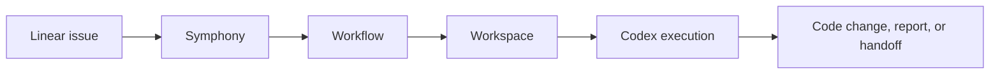
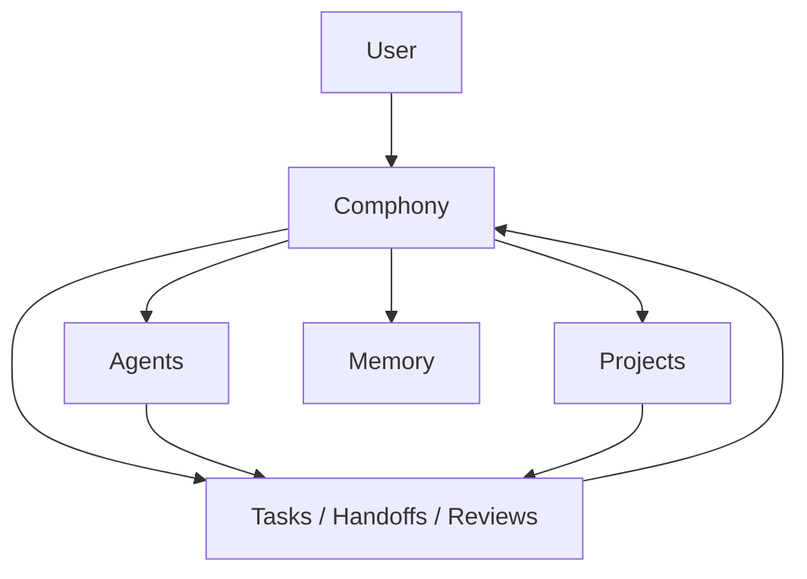

# Comphony

Build and operate an AI-native company through one front door.

`Comphony` is evolving from a Symphony/Linear operating prototype into a local-first company operating system where a user talks to `Comphony`, agents collaborate, and work flows across projects with memory, handoff, review, and reporting.

Clone this repo, open Codex, and ask it to set everything up for you in one shot.

## Product Direction

Comphony is not just a workflow repo.

It is meant to become:

- a single conversational front door called `Comphony`
- a local-first company runtime
- an agent registry
- a project registry
- a task graph with handoff, review, and consultation
- a memory layer
- a web and mobile-friendly control surface
- optional sync and external channels later

In other words: the goal is to let a user run a company of AI workers, not just wire a set of automations together.

## Current Foundation

The current repo still contains strong Symphony-based operating assets:

- `Linear`
  - task tracking and project lanes
- `Symphony`
  - orchestration prototype
- `Codex`
  - execution layer
- `Workflows`
  - role/lane behavior
- `Workspaces`
  - issue execution directories



Those pieces are still useful, but they are now part of a bigger product direction.

## Target Product Model

The intended product looks more like this:



That means the user experience should become:

- talk to one company
- let the company route the work
- inspect who is doing what
- interrupt and redirect tasks
- talk directly to specific agents when needed
- ask about previous work and decisions

## One-Shot Setup With Codex

You should still be able to clone this repo and simply say:

```text
Read this repo and set it up for me.
Create any missing local setup files yourself, including MISSION.md.
Keep going until Comphony is working end-to-end.
```

From there, Codex is expected to:

1. read `AGENTS.md` and the setup docs
2. create `MISSION.md` automatically if it does not exist
3. prepare the local directory layout
4. set up the current runtime foundations
5. connect the relevant systems
6. generate runnable local assets
7. verify the system with smoke tests

The goal is not just to explain the system.
The goal is to reach a working company runtime.

## Repository Layout

Comphony standardizes the local machine layout like this:

```text
comphony/
  .codex/
  AGENTS.md
  agents/
  company.yaml
  MISSION.md
  MISSION.template.md
  docs/
  repos/
  runtime-data/
  workspaces/
  workflows/
```

What each folder means:

- `docs/`
  - operating docs and workflow templates
- `.codex/skills/`
  - project-local Codex skills such as `ui-ux-pro-max`
- `agents/`
  - first-party installable agent packages
- `repos/`
  - canonical source repos
- `runtime-data/`
  - local runtime state and imported package cache
- `workspaces/`
  - issue-specific working directories
- `workflows/`
  - real runnable workflow files for the local machine

## Local-Only State Stays Local

This repo is designed so each user can run their own local setup without polluting the shared repo.

The following are intentionally ignored:

- `MISSION.md`
- `repos/*`
- `runtime-data/*`
- `workspaces/*`
- `workflows/*`

That means:

- the docs and templates are shared
- each person keeps their own local repos, workspaces, and runtime workflow files
- actual product repos can still have their own Git history and their own commits

## Setup Validation

Comphony now includes a simple local setup test flow:

- `./tests/preflight.sh`
  - checks the repo structure right after clone
- `./scripts/init-local-setup.sh`
  - creates `.env` and `MISSION.md` from templates if needed
- `./tests/validate-setup.sh`
  - checks that Codex actually finished the setup
- `./scripts/reset-local-state.sh --confirm`
  - clears local generated state so you can test the setup flow again

The local environment template is tracked as [.env.example](.env.example), while `.env` itself stays ignored.

The runtime auto-loads `.env` and `.env.local` from the same directory as [company.yaml](/Users/tahooki/Documents/comphony/company.yaml). That means `npm run comphony -- ...` and `npm run server:start` pick up Supabase, Linear, and local runtime secrets without requiring a manual `export` step.

## Runtime MVP

The repo now includes the first real local runtime slice:

- [company.yaml](/Users/tahooki/Documents/comphony/company.yaml)
  - tracked company configuration
- [package.json](/Users/tahooki/Documents/comphony/package.json)
  - Node/TypeScript package and CLI scripts
- [tsconfig.json](/Users/tahooki/Documents/comphony/tsconfig.json)
  - TypeScript compiler configuration
- [src/cli.ts](/Users/tahooki/Documents/comphony/src/cli.ts)
  - `init`, `validate`, `project list/overview/create`, `agent list/catalog/install/assign-project`, `people list`, `task create/list/assign/autoassign/status/work/recommend/sync`, `consult`, `review`, `approval`, `sync list/push/retry`, `session list/create/revoke`, `connector ingest`, `thread show/continue/ask`, and `server start`
- [src/server.ts](/Users/tahooki/Documents/comphony/src/server.ts)
  - minimal HTTP runtime
- [src/state.ts](/Users/tahooki/Documents/comphony/src/state.ts)
  - local persistent state for projects, agents, tasks, and threads

Quick start:

```bash
npm install
npm run validate:config
npm run server:start
```

Then open:

- [http://127.0.0.1:43110/](http://127.0.0.1:43110/)

Task workflow example:

```bash
npm run comphony -- project list
npm run comphony -- agent list --project product_core
npm run comphony -- task create --project product_core --lane design --title "Plan dashboard refresh"
npm run comphony -- task list --project product_core
npm run comphony -- task autoassign --task task_0001
npm run comphony -- task status --task task_0001 --status in_progress
npm run comphony -- task work --task task_0001
npm run comphony -- task recommend --project product_core --query "dashboard ui ux"
npm run comphony -- project overview
npm run comphony -- people list
npm run comphony -- project create --id research_lab --name "Research Lab" --lanes planning,research --repo-slug research-lab
npm run comphony -- agent install --source-kind local_package --ref ./agents/design_planner_01
npm run comphony -- agent install --source-kind registry_package --ref https://registry.example.com/agents/remote-designer
npm run comphony -- agent catalog
npm run comphony -- agent assign-project --agent design_planner_01 --project product_core
npm run comphony -- consult request --task task_0001 --agent desk_coordinator --reason "Need clarification"
npm run comphony -- review request --task task_0001 --reviewer frontend_publisher_01 --reason "Ready for review"
npm run comphony -- approval request --task task_0001 --action external_sync --reason "Needs explicit approval"
npm run comphony -- task sync --task task_0001 --provider linear
npm run comphony -- session create --actor owner_01 --label "mobile"
npm run comphony -- sync push --provider supabase
npm run comphony -- connector ingest --provider telegram --sender-id tg_001 --body "Please redesign the dashboard UI."
npm run comphony -- sync list
```

Conversation workflow example:

```bash
npm run comphony -- thread create --title "Dashboard refresh request"
npm run comphony -- message send --thread thread_0001 --body "Please design a cleaner dashboard UI for Product - Core."
npm run comphony -- message list --thread thread_0001
npm run comphony -- message promote --message msg_0001
npm run comphony -- thread show --thread thread_0001
npm run comphony -- thread continue --thread thread_0001
npm run comphony -- thread ask --thread thread_0001 --body "What is the current status?"
npm run comphony -- memory list --thread thread_0001
npm run comphony -- memory recommend --thread thread_0001 --query "current status"
```

One-shot intake example:

```bash
npm run comphony -- intake create \
  --title "Refresh Product - Core dashboard" \
  --body "Please redesign the Product - Core dashboard UI and improve the UX."
```

Browser workflow example:

- open [http://127.0.0.1:43110/](http://127.0.0.1:43110/)
- submit an intake request
- select a thread from the left column
- continue the selected thread from chat without manually stepping each workflow transition
- send a follow-up question in the selected thread, including `@agent` messages
- inspect the task graph, people, projects, and memory views
- use Advanced Mode only when you want to intervene directly in low-level operations
- use Advanced Mode to mirror a task out to Linear with `Sync Linear`
- watch the event stream refresh automatically
- inspect related memory ranked for the selected thread and question
- inspect similar tasks ranked for the selected thread and follow-up

HTTP auth note:

- when `auth.require_auth_for_remote_clients` is enabled, mutation endpoints require `X-Comphony-Actor-Id`
- or a session token through `Authorization: Bearer <token>` or `X-Comphony-Session-Token`
- the bundled web UI sends `owner_01` by default for local use

Remote control plane note:

- `POST /v1/sync/push` mirrors the current runtime snapshot and recent events to Supabase when the provider is enabled
- `POST /v1/connectors/<provider>/messages` lets Telegram, Discord, or Slack act as remote Comphony inboxes
- `POST /v1/auth/login` and `POST /v1/auth/logout` provide lightweight local-first session handling

Build handoff rule:

- assigning a task to a `build` or `publishing` agent requires these files in the canonical repo:
  - `design-system/MASTER.md`
  - `plans/design/design-plan.md`
  - `plans/design/dev-handoff.md`

Work turn behavior:

- `task work` and `POST /v1/tasks/work` now create real local artifacts
- `design` agents write the design system and handoff files into the canonical repo
- `build`, `publishing`, and `coordination` agents write notes into the task workspace
- the generated artifact paths are attached to the task record and echoed back into the thread
- `task handoff` and `POST /v1/tasks/handoff` move work into the next lane and auto-assign the next eligible agent

External sync rule:

- when `policies.external_sync_requires_auth` is `true`, `task sync` and `POST /v1/tasks/sync` require a granted approval for the `external_sync` action on that task
- the default CLI and web flow is: request approval -> grant approval -> sync to Linear

Available server endpoints:

- `GET /healthz`
- `GET /v1/status`
- `GET /v1/auth/session`
- `GET /v1/tasks/recommend`
- `GET /v1/projects`
- `GET /v1/projects/overview`
- `GET /v1/agents`
- `GET /v1/agents/catalog`
- `GET /v1/people`
- `GET /v1/sessions`
- `GET /v1/tasks`
- `GET /v1/threads`
- `GET /v1/threads/:threadId`
- `GET /v1/messages?threadId=<thread-id>`
- `GET /v1/events?limit=20`
- `GET /v1/events/stream`
- `GET /v1/memory`
- `GET /v1/memory/recommend`
- `GET /v1/consultations`
- `GET /v1/reviews`
- `GET /v1/approvals`
- `GET /v1/sync`
- `POST /v1/intake`
- `POST /v1/threads`
- `POST /v1/threads/continue`
- `POST /v1/threads/respond`
- `POST /v1/messages`
- `POST /v1/messages/promote`
- `POST /v1/tasks/assign`
- `POST /v1/tasks/handoff`
- `POST /v1/tasks/work`
- `POST /v1/tasks/status`
- `POST /v1/tasks/sync`
- `POST /v1/tasks/consult`
- `POST /v1/consultations/resolve`
- `POST /v1/tasks/review`
- `POST /v1/reviews/complete`
- `POST /v1/approvals/request`
- `POST /v1/approvals/decide`
- `POST /v1/projects`
- `POST /v1/agents/install`
- `POST /v1/agents/assign-project`
- `POST /v1/auth/login`
- `POST /v1/auth/logout`
- `POST /v1/connectors/telegram/messages`
- `POST /v1/connectors/discord/messages`
- `POST /v1/connectors/slack/messages`
- `POST /v1/sync/push`
- `POST /v1/sync/retry`

## Start Here

- [Purpose And Vision](docs/COMPHONY_PURPOSE_AND_VISION.md)
- [User Experience](docs/COMPHONY_USER_EXPERIENCE.md)
- [Final Architecture](docs/COMPHONY_FINAL_ARCHITECTURE.md)
- [System Architecture](docs/COMPHONY_SYSTEM_ARCHITECTURE.md)
- [Data Model](docs/COMPHONY_DATA_MODEL.md)
- [UI Information Architecture](docs/COMPHONY_UI_INFORMATION_ARCHITECTURE.md)
- [Trust And Permissions](docs/COMPHONY_TRUST_AND_PERMISSIONS.md)
- [Sync And Source Of Truth](docs/COMPHONY_SYNC_AND_SOURCE_OF_TRUTH.md)
- [Autonomy Policy](docs/COMPHONY_AUTONOMY_POLICY.md)
- [Agent Package Spec](docs/COMPHONY_AGENT_PACKAGE_SPEC.md)
- [Execution State Machine](docs/COMPHONY_EXECUTION_STATE_MACHINE.md)
- [API And Event Protocol](docs/COMPHONY_API_AND_EVENT_PROTOCOL.md)
- [Config Spec](docs/COMPHONY_CONFIG_SPEC.md)
- [Identity And Memory Policy](docs/COMPHONY_IDENTITY_AND_MEMORY_POLICY.md)
- [MVP And Development](docs/COMPHONY_MVP_AND_DEVELOPMENT.md)
- [Operating-Level Development Plan](docs/OPERATING_LEVEL_DEVELOPMENT_PLAN.md)
- [Comphony Desk Model](docs/COMPHONY_DESK_MODEL.md)
- [Comphony Company Model](docs/COMPHONY_COMPANY_MODEL.md)
- [UI UX Pro Max Guide](docs/UI_UX_PRO_MAX_GUIDE.md)
- [Setup Test Flow](tests/README.md)

## In One Sentence

Comphony is a local-first operating system for running a company of AI agents through one conversational front door.
