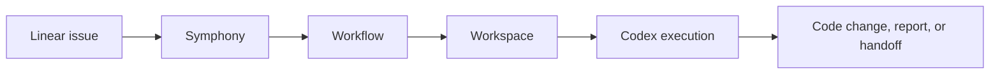
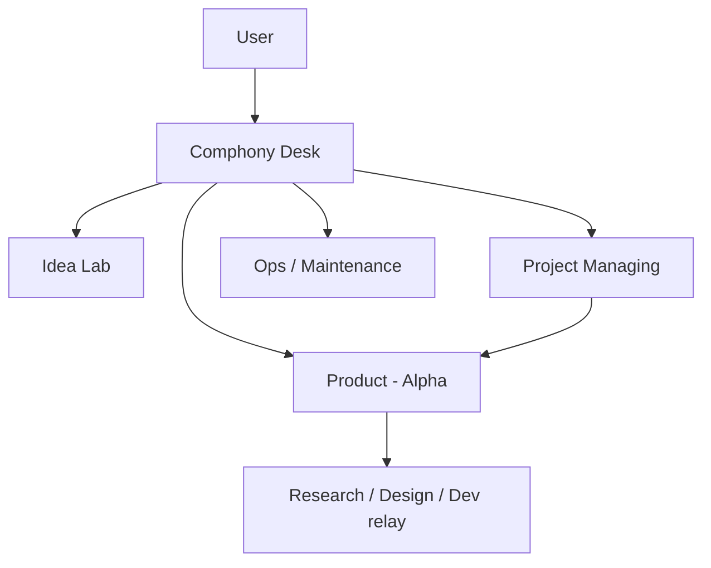

# Comphony

Build an AI company on top of `Symphony`, `Linear`, and `Codex`.

Clone this repo, open Codex, and ask it to set everything up for you in one shot.
Comphony is designed as a control repo for turning a blank machine into a working AI operating system where ideas become projects, projects become repos, and Linear issues become real execution.

## What This Builds

Comphony is not just a docs repo. It is a model for an AI-native company structure.

The default company looks like this:

- `Comphony Desk`
  - single human-facing intake lane
  - classifies requests and delegates work
  - collects final reports from downstream projects
- `Idea Lab`
  - collect ideas
  - refine requests
  - research opportunities
- `Project Managing`
  - create new repos
  - create new Linear projects
  - generate new workflow files
  - bootstrap new operating lanes
- `Product - <Name>`
  - run real product work
  - split work across PM, Research, Design, and Dev if needed
- optional `Ops` or `Maintenance` lanes
  - handle operational work, automation, and production follow-up

In other words: this repo helps you build a company made of projects, roles, workflows, and issue-driven execution.

## How It Works

Comphony wires together five layers:

- `Linear`
  - the task system
  - where work is requested and tracked
- `Symphony`
  - the orchestrator
  - watches Linear and starts work
- `Codex`
  - the execution agent
  - reads the docs, creates setup files, and performs the work
- `Workflows`
  - define which Linear project to watch
  - define which role to play
  - define which repo to prepare and how
- `Workspaces`
  - isolated issue-specific folders where actual work happens



## The Company Model

The recommended operating model is simple and scalable:



That means:

- people talk to `Comphony Desk`
- ideas start in `Idea Lab`
- setup and provisioning move into `Project Managing`
- new products get their own Linear projects, repos, and workflows
- day-to-day execution happens in product-specific lanes
- final reporting can be pulled back into the Desk parent issue

This gives you a structure that feels closer to an actual company than a single automation script.

## One-Shot Setup With Codex

You should be able to clone this repo and simply say:

```text
Read this repo and set it up for me.
Create any missing local setup files yourself, including MISSION.md.
Keep going until Linear + Symphony is working end-to-end.
```

From there, Codex is expected to:

1. read `AGENTS.md` and the setup docs
2. create `MISSION.md` automatically if it does not exist
3. prepare the local directory layout
4. connect Symphony to Linear
5. create the required Linear projects and states
6. generate runnable workflow files
7. verify the system with a smoke test issue

The goal is not to stop at explanation. The goal is to reach a working state where you can create a Linear issue and watch execution start.

## Repository Layout

Comphony standardizes the local machine layout like this:

```text
comphony/
  .codex/
  AGENTS.md
  MISSION.md
  MISSION.template.md
  docs/
  repos/
  workspaces/
  workflows/
```

What each folder means:

- `docs/`
  - operating docs and workflow templates
- `.codex/skills/`
  - project-local Codex skills such as `ui-ux-pro-max`
- `repos/`
  - canonical source repos
- `workspaces/`
  - issue-specific working directories
- `workflows/`
  - real runnable workflow files for the local machine

Naming matters:

- use `repos` for source repos
- use `workspaces` for isolated issue execution
- use `workflows` for runnable setup files
- keep `projects` as a Linear concept, not a filesystem folder name

## Local-Only State Stays Local

This repo is designed so each user can run their own local setup without polluting the shared repo.

The following are intentionally ignored:

- `MISSION.md`
- `repos/*`
- `workspaces/*`
- `workflows/*`

That means:

- the docs and templates are shared
- each person keeps their own local repos, workspaces, and runtime workflow files
- actual product repos can still have their own Git history and their own commits

## Setup Validation

Comphony now includes a simple local setup test flow:

- `./tests/preflight.sh`
  - checks the repo structure right after clone
- `./scripts/init-local-setup.sh`
  - creates `.env` and `MISSION.md` from templates if needed
- `./tests/validate-setup.sh`
  - checks that Codex actually finished the setup
- `./scripts/reset-local-state.sh --confirm`
  - clears local generated state so you can test the setup flow again

The local environment template is tracked as [.env.example](.env.example), while `.env` itself stays ignored.

## Start Here

- [Start With Codex](docs/START_WITH_CODEX.md)
- [Local Layout](docs/LOCAL_LAYOUT.md)
- [Symphony Basics](docs/SYMPHONY_BASICS.md)
- [UI UX Pro Max Guide](docs/UI_UX_PRO_MAX_GUIDE.md)
- [Operating-Level Development Plan](docs/OPERATING_LEVEL_DEVELOPMENT_PLAN.md)
- [Comphony Desk Model](docs/COMPHONY_DESK_MODEL.md)
- [Comphony Company Model](docs/COMPHONY_COMPANY_MODEL.md)
- [Scenario Matrix](docs/SCENARIO_MATRIX.md)
- [Issue Lifecycle](docs/ISSUE_LIFECYCLE.md)
- [Workflow Parts](docs/WORKFLOW_PARTS.md)
- [Setup Test Flow](tests/README.md)

## In One Sentence

Comphony is a repo for building an AI company with Symphony, then using Codex to set up the whole operating system end-to-end.
