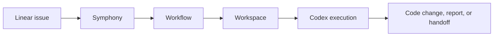
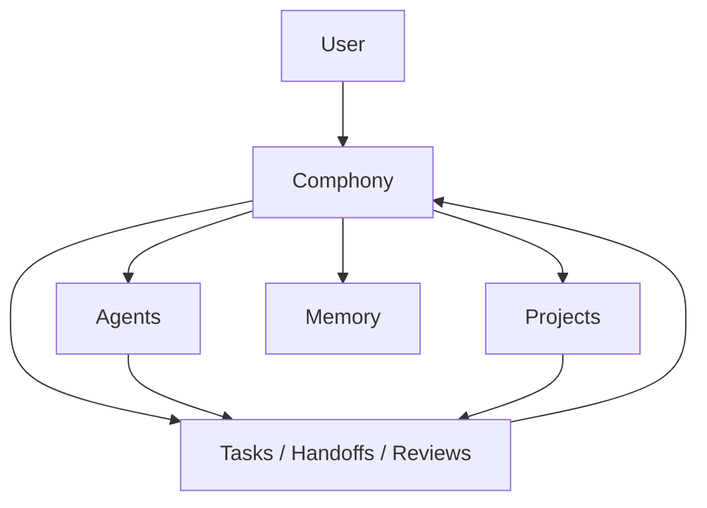

# Comphony

Build and operate an AI-native company through one front door.

`Comphony` is evolving from a Symphony/Linear operating prototype into a local-first company operating system where a user talks to `Comphony`, agents collaborate, and work flows across projects with memory, handoff, review, and reporting.

Clone this repo, open Codex, and ask it to set everything up for you in one shot.

## Product Direction

Comphony is not just a workflow repo.

It is meant to become:

- a single conversational front door called `Comphony`
- a local-first company runtime
- an agent registry
- a project registry
- a task graph with handoff, review, and consultation
- a memory layer
- a web and mobile-friendly control surface
- optional sync and external channels later

In other words: the goal is to let a user run a company of AI workers, not just wire a set of automations together.

## Current Foundation

The current repo still contains strong Symphony-based operating assets:

- `Linear`
  - task tracking and project lanes
- `Symphony`
  - orchestration prototype
- `Codex`
  - execution layer
- `Workflows`
  - role/lane behavior
- `Workspaces`
  - issue execution directories



Those pieces are still useful, but they are now part of a bigger product direction.

## Target Product Model

The intended product looks more like this:



That means the user experience should become:

- talk to one company
- let the company route the work
- inspect who is doing what
- interrupt and redirect tasks
- talk directly to specific agents when needed
- ask about previous work and decisions

## One-Shot Setup With Codex

You should still be able to clone this repo and simply say:

```text
Read this repo and set it up for me.
Create any missing local setup files yourself, including MISSION.md.
Keep going until Comphony is working end-to-end.
```

From there, Codex is expected to:

1. read `AGENTS.md` and the setup docs
2. create `MISSION.md` automatically if it does not exist
3. prepare the local directory layout
4. set up the current runtime foundations
5. connect the relevant systems
6. generate runnable local assets
7. verify the system with smoke tests

The goal is not just to explain the system.
The goal is to reach a working company runtime.

## Repository Layout

Comphony standardizes the local machine layout like this:

```text
comphony/
  .codex/
  AGENTS.md
  MISSION.md
  MISSION.template.md
  docs/
  repos/
  workspaces/
  workflows/
```

What each folder means:

- `docs/`
  - operating docs and workflow templates
- `.codex/skills/`
  - project-local Codex skills such as `ui-ux-pro-max`
- `repos/`
  - canonical source repos
- `workspaces/`
  - issue-specific working directories
- `workflows/`
  - real runnable workflow files for the local machine

## Local-Only State Stays Local

This repo is designed so each user can run their own local setup without polluting the shared repo.

The following are intentionally ignored:

- `MISSION.md`
- `repos/*`
- `workspaces/*`
- `workflows/*`

That means:

- the docs and templates are shared
- each person keeps their own local repos, workspaces, and runtime workflow files
- actual product repos can still have their own Git history and their own commits

## Setup Validation

Comphony now includes a simple local setup test flow:

- `./tests/preflight.sh`
  - checks the repo structure right after clone
- `./scripts/init-local-setup.sh`
  - creates `.env` and `MISSION.md` from templates if needed
- `./tests/validate-setup.sh`
  - checks that Codex actually finished the setup
- `./scripts/reset-local-state.sh --confirm`
  - clears local generated state so you can test the setup flow again

The local environment template is tracked as [.env.example](.env.example), while `.env` itself stays ignored.

## Start Here

- [Purpose And Vision](docs/COMPHONY_PURPOSE_AND_VISION.md)
- [User Experience](docs/COMPHONY_USER_EXPERIENCE.md)
- [Final Architecture](docs/COMPHONY_FINAL_ARCHITECTURE.md)
- [System Architecture](docs/COMPHONY_SYSTEM_ARCHITECTURE.md)
- [Data Model](docs/COMPHONY_DATA_MODEL.md)
- [UI Information Architecture](docs/COMPHONY_UI_INFORMATION_ARCHITECTURE.md)
- [MVP And Development](docs/COMPHONY_MVP_AND_DEVELOPMENT.md)
- [Operating-Level Development Plan](docs/OPERATING_LEVEL_DEVELOPMENT_PLAN.md)
- [Comphony Desk Model](docs/COMPHONY_DESK_MODEL.md)
- [Comphony Company Model](docs/COMPHONY_COMPANY_MODEL.md)
- [UI UX Pro Max Guide](docs/UI_UX_PRO_MAX_GUIDE.md)
- [Setup Test Flow](tests/README.md)

## In One Sentence

Comphony is a local-first operating system for running a company of AI agents through one conversational front door.
