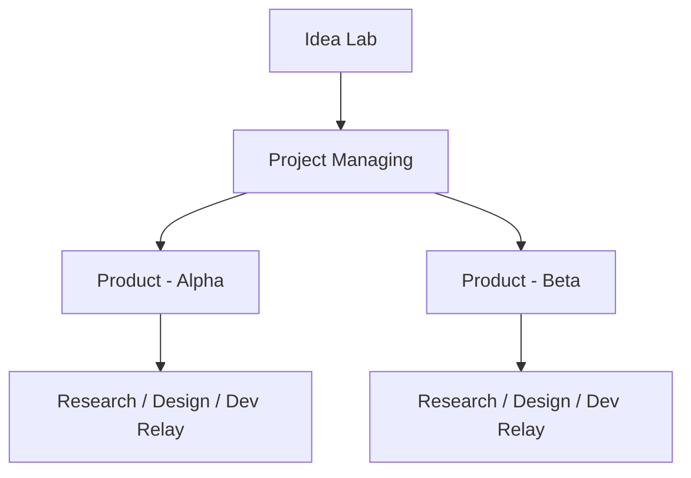

# Comphony Company Model

이 문서는 `Comphony`를 하나의 회사처럼 운영한다는 가정으로, Linear 프로젝트와 Symphony workflow를 어떤 조직 구조로 나누면 되는지 설명한다.

핵심 목표는 세 가지다.

- 아이디어와 실행을 섞지 않는다.
- repo와 역할(PM / Research / Design / Dev)을 분리한다.
- 새 프로젝트를 반복 가능하게 만든다.

## 1. 한 줄 개념

Comphony를 회사처럼 보면 각 요소의 역할은 다음과 같다.

- `Linear 프로젝트` = 회사의 부서 또는 팀 큐
- `Workflow 파일` = 각 부서에서 일하는 직원의 역할 정의서
- `Repo` = 실제 제품이나 운영 자산
- `Workspace` = 개별 업무를 처리하는 책상

즉 "어떤 부서가 어떤 성격의 일을 받는가"는 Linear 프로젝트가 정하고, "그 부서가 일을 어떤 방식으로 처리하는가"는 workflow가 정한다.

## 2. 추천 회사 구조

가장 추천하는 기본 구조는 아래와 같다.

이 구조에서 각 프로젝트의 의미는 다음과 같다.

### 1. Idea Lab

새 아이디어, 리서치 요청, 문제 발견, 개선 아이디어를 다룬다.

- 역할
  - 아이디어 수집
  - 초안 PRD 작성
  - 간단한 시장 조사
  - 우선순위 후보 정리
- 주된 workflow
  - `PM workflow`
  - `Research workflow`
- repo 필요성
  - 보통 없음
  - 필요하면 문서 repo 또는 knowledge repo만 연결

### 2. Project Managing

채택된 아이디어를 실제 프로젝트로 전환하는 메타 운영 부서다.

- 역할
  - 새 repo 생성
  - 새 Linear 프로젝트 생성
  - 새 workflow 파일 생성
  - 초기 문서 / README / bootstrap 생성
- 주된 workflow
  - `project-admin workflow`
- repo 필요성
  - 보통 `project-admin` 같은 관리용 repo 사용

### 3. Product - <이름>

실제 제품 개발이 일어나는 실행 부서다.

- 역할
  - 기능 개발
  - 버그 수정
  - 디자인 반영
  - 릴리즈 준비
- 주된 workflow
  - `Research workflow`
  - `Design workflow`
  - `Dev workflow`
- repo 필요성
  - 제품 repo 필요

### 4. Ops / Maintenance

운영 작업이 많아질 때만 분리한다.

- 역할
  - 장애 분석
  - 운영 자동화
  - 배포/인프라 후속 작업
- 주된 workflow
  - 운영 전용 `Dev workflow`
  - 필요하면 `Research workflow`

## 3. 프로젝트와 workflow의 연결 방식

추천 연결은 아래처럼 단순하게 잡는 것이다.

| Linear 프로젝트 | 목적 | 대표 workflow | repo |
| --- | --- | --- | --- |
| `Idea Lab` | 아이디어, 기획, 탐색 | `WORKFLOW.pm.md`, `WORKFLOW.research.md` | 선택 |
| `Project Managing` | 새 프로젝트 provisioning | `WORKFLOW.project-admin.md` | 관리용 repo |
| `Product - Foo` | 실제 제품 실행 | `WORKFLOW.design.md`, `WORKFLOW.dev.relay.md` | 제품 repo |

핵심은 `같은 프로젝트를 보더라도 workflow는 상태별로 역할을 분리`한다는 점이다.

예를 들면 `Product - Foo` 프로젝트 안에서:

- `Research` 상태는 research workflow가 처리
- `Design` 상태는 design workflow가 처리
- `Todo`, `In Progress`, `Rework`는 dev workflow가 처리

즉 하나의 제품 프로젝트 안에 여러 역할이 공존할 수 있지만, 충돌을 막기 위해 상태를 나눠서 릴레이 방식으로 운영한다.

## 4. 부서별 추천 상태 구조

### Idea Lab

- `Inbox`
- `Planning`
- `Research`
- `Approved`
- `Rejected`

### Project Managing

- `Requested`
- `Provisioning`
- `Verification`
- `Done`

### Product - <이름>

- `Planning`
- `Research`
- `Design`
- `Todo`
- `In Progress`
- `Rework`
- `Human Review`
- `Merging`
- `Done`

이 구조의 장점은 "같은 프로젝트 안에서 역할 릴레이"가 자연스럽다는 점이다.

## 5. 이 회사 구조에서 이슈는 어떻게 흐르는가

### 흐름 A: 아이디어에서 제품 프로젝트까지

1. `Idea Lab`에 아이디어 이슈를 만든다.
2. PM 또는 Research workflow가 아이디어를 정리한다.
3. 가치가 있다고 판단되면 상태를 `Approved`로 바꾼다.
4. `Project Managing`에 새 이슈를 만든다.
5. project-admin workflow가 새 repo, 새 Linear 프로젝트, 새 workflow를 준비한다.
6. 결과로 `Product - Foo` 프로젝트가 생긴다.
7. 실제 개발 이슈는 `Product - Foo`에서 처리한다.

### 흐름 B: 기존 제품 기능 개발

1. `Product - Foo`에 기능 이슈를 만든다.
2. 상태가 `Planning`이면 PM 성격 workflow가 요구사항을 다듬는다.
3. 상태가 `Research`이면 리서치 workflow가 비교/조사를 수행한다.
4. 상태가 `Design`이면 디자인 workflow가 화면 구조와 카피를 정리한다.
5. 상태가 `Todo` 또는 `In Progress`가 되면 dev workflow가 workspace에서 실제 코드를 수정한다.
6. 검증 후 `Human Review` 또는 `Done`으로 넘긴다.

### 흐름 C: 새 프로젝트 생성

1. `Project Managing`에 `Bootstrap new project Foo` 이슈를 만든다.
2. 이슈 본문에 repo 이름, 제품 이름, 사용할 스택, 원하는 상태 구조를 적는다.
3. project-admin workflow가:
   - repo 생성
   - Linear 프로젝트 생성
   - workflow 파일 생성
   - 기본 문서 생성
4. 완료 후 결과 경로와 운영 방법을 기록한다.

## 6. 역할 분리는 어디서 일어나는가

이 구조에서 역할 분리는 세 군데에서 일어난다.

### 1. Linear 프로젝트

어느 부서가 이슈를 받을지 정한다.

- `Idea Lab`
- `Project Managing`
- `Product - Foo`

### 2. Workflow 파일

같은 부서 안에서도 어떤 역할로 행동할지 정한다.

- PM
- Research
- Design
- Dev
- Project Admin

### 3. Workflow의 repo bootstrap

어떤 repo를 작업 대상으로 삼을지 정한다.

- repo 없음
- 문서 repo
- 제품 repo
- 관리용 repo

즉 `부서`, `직군`, `작업 대상`은 서로 다른 축이다.

## 7. 운영할 때 가장 많이 쓰는 패턴

### 패턴 A: 작은 팀

프로젝트 수를 최소화하고 싶은 경우:

- `Idea Lab`
- `Project Managing`
- `Product - Foo`

이 패턴은 작은 팀에 적합하다.

### 패턴 B: 여러 제품 동시 운영

제품이 늘어나면 제품별 실행 프로젝트를 나눈다.

- `Idea Lab`
- `Project Managing`
- `Product - Foo`
- `Product - Bar`
- `Product - Baz`

각 제품 프로젝트는 자기 repo와 workflow를 가진다.

### 패턴 C: 연구 조직이 큰 경우

리서치 성격이 강하면 `Research Hub`를 추가할 수 있다.

- `Idea Lab`
- `Research Hub`
- `Project Managing`
- `Product - Foo`

다만 초반에는 프로젝트 수를 늘리지 않는 편이 낫다.

## 8. 새 제품을 만들 때 권장 템플릿

새 제품 하나를 만들 때는 아래 조합을 권장한다.

- Linear 프로젝트: `Product - Foo`
- repo: `foo`
- workflow:
  - `WORKFLOW.foo.research.md`
  - `WORKFLOW.foo.design.md`
  - `WORKFLOW.foo.dev.md`

처음에는 더 단순하게 시작해도 된다.

- `WORKFLOW.foo.dev.md` 하나만 둔다.
- 필요해지면 research/design workflow를 추가한다.

## 9. 이 구조가 좋은 이유

- 아이디어와 실제 개발이 섞이지 않는다.
- 새 프로젝트를 반복 가능한 절차로 만들 수 있다.
- PM / Research / Design / Dev 역할을 상태 기반 릴레이로 나눌 수 있다.
- repo별로 설치 방식, 테스트 명령, workspace 전략을 다르게 둘 수 있다.
- 회사 규모가 커져도 `Idea -> Provisioning -> Execution` 구조를 유지할 수 있다.

## 10. Comphony 시작 권장안

처음에는 아래 3개 프로젝트만 만드는 것을 권장한다.

1. `Idea Lab`
2. `Project Managing`
3. `Product - Core`

그리고 workflow는 아래 4개만 둔다.

1. PM workflow
2. Research workflow
3. Dev workflow
4. Project-admin workflow

그 다음 실제 운영하면서 필요할 때만 `Design workflow`와 제품별 추가 프로젝트를 늘리면 된다.

## 11. 같이 읽으면 좋은 문서

- [README.md](README.md)
- [SCENARIO_MATRIX.md](SCENARIO_MATRIX.md)
- [ISSUE_LIFECYCLE.md](ISSUE_LIFECYCLE.md)
- [WORKFLOW_PARTS.md](WORKFLOW_PARTS.md)
- [LINEAR_SYMPHONY_WORKFLOW_GUIDE.md](LINEAR_SYMPHONY_WORKFLOW_GUIDE.md)
