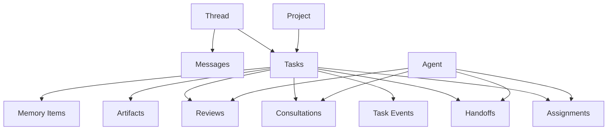

# Comphony Data Model

This document defines the recommended data model for the next version of `Comphony`.

The goal is not to model a task board.
The goal is to model a company.

## 1. Modeling Principle

The system should model:

- who exists
- what work exists
- where work belongs
- who owns it now
- who owned it before
- who needs to review it
- what was said
- what was decided
- what was produced

That means the data model should be graph-friendly and event-friendly.

## 2. Core Entities

The minimum first-class entities should be:

- `agent`
- `project`
- `thread`
- `message`
- `task`
- `task_event`
- `assignment`
- `handoff`
- `consultation`
- `review`
- `artifact`
- `memory_item`
- `agent_template`
- `agent_install_source`

## 3. Agent

Represents a worker in the company.

Suggested fields:

```yaml
id:
name:
slug:
role:
description:
status:
availability:
capabilities:
skills:
tools:
memory_scope:
project_ids:
lane_permissions:
handoff_permissions:
review_permissions:
source_type:
source_ref:
```

Important notes:

- `role` is descriptive, not sufficient by itself
- `capabilities` and `permissions` drive routing
- `source_ref` lets externally installed agents remain traceable

## 4. Agent Template

Represents a reusable worker definition before installation.

Suggested fields:

```yaml
id:
name:
role:
description:
capabilities:
skills:
prompt_bundle:
tools:
metadata_url:
version:
publisher:
```

This is the foundation for a future hiring marketplace.

## 5. Project

Represents a working domain.

Suggested fields:

```yaml
id:
name:
slug:
description:
status:
repo_config:
runtime_config:
assigned_agent_ids:
default_lanes:
review_policy:
memory_scope:
tracker_sync:
```

Notes:

- a project may represent a product, an operational area, or a research lane
- this should not be tightly coupled to one external tracker

## 6. Thread

Represents a conversation container.

This can be:

- user to company
- user to agent
- agent to agent
- system-generated coordination thread

Suggested fields:

```yaml
id:
kind:
title:
project_id:
created_by_actor_id:
participant_ids:
linked_task_ids:
status:
```

## 7. Message

Represents one conversational unit.

Suggested fields:

```yaml
id:
thread_id:
author_actor_id:
kind:
body:
created_at:
reply_to_message_id:
visible_to_user:
metadata:
```

`kind` may include:

- user_message
- agent_message
- system_message
- status_update
- review_request

## 8. Task

Represents a unit of work.

Suggested fields:

```yaml
id:
title:
description:
project_id:
source_thread_id:
parent_task_id:
status:
priority:
owner_agent_id:
requested_by_actor_id:
next_recommended_agent_id:
blocking_reason:
requested_reviewer_id:
lane:
tracker_ref:
```

Notes:

- `lane` is better than hardwiring board-state logic into the model
- `tracker_ref` should be optional

## 9. Task Event

Represents the history of a task.

Suggested fields:

```yaml
id:
task_id:
event_type:
actor_id:
payload:
created_at:
```

Examples:

- task_created
- assigned
- handed_off
- consultation_requested
- review_requested
- blocked
- unblocked
- completed

This is critical for explainability.

## 10. Assignment

Represents current or past ownership.

Suggested fields:

```yaml
id:
task_id:
agent_id:
assigned_by_actor_id:
reason:
started_at:
ended_at:
active:
```

## 11. Handoff

Represents delegation from one worker to another.

Suggested fields:

```yaml
id:
task_id:
from_actor_id:
to_actor_id:
reason:
instructions:
status:
created_at:
resolved_at:
```

This should be distinct from assignment history because handoff has intent and explanatory value.

## 12. Consultation

Represents agent-to-agent inquiry without full transfer of ownership.

Suggested fields:

```yaml
id:
task_id:
from_actor_id:
to_actor_id:
question:
status:
response_summary:
created_at:
resolved_at:
```

This is important because the user explicitly wants agents to ask other agents questions.

## 13. Review

Represents a review or approval loop.

Suggested fields:

```yaml
id:
task_id:
requested_by_actor_id:
reviewer_actor_id:
review_type:
status:
summary:
created_at:
resolved_at:
```

Review types may include:

- design_review
- code_review
- pm_review
- final_approval

## 14. Artifact

Represents an output of work.

Suggested fields:

```yaml
id:
task_id:
kind:
title:
path:
url:
summary:
created_by_actor_id:
created_at:
metadata:
```

Kinds may include:

- document
- code_change
- report
- screenshot
- deck
- design_system

## 15. Memory Item

Represents persistent reusable knowledge.

Suggested fields:

```yaml
id:
scope:
scope_ref:
title:
body:
tags:
source_task_id:
source_thread_id:
created_by_actor_id:
importance:
created_at:
```

`scope` may include:

- company
- project
- agent
- task

## 16. Agent Install Source

Represents where an installed agent came from.

Suggested fields:

```yaml
id:
agent_id:
source_kind:
source_url:
publisher:
version:
checksum:
installed_at:
```

This supports link-based hiring and traceability.

## 17. Relationship Summary

The most important relationships are:



## 18. Why This Model Matters

This model is better than a flat issue model because it directly supports:

- chat-driven task creation
- multi-agent collaboration
- review loops
- consultation loops
- memory lookup
- agent hiring and assignment

This is the minimum model that can support the product vision cleanly.
