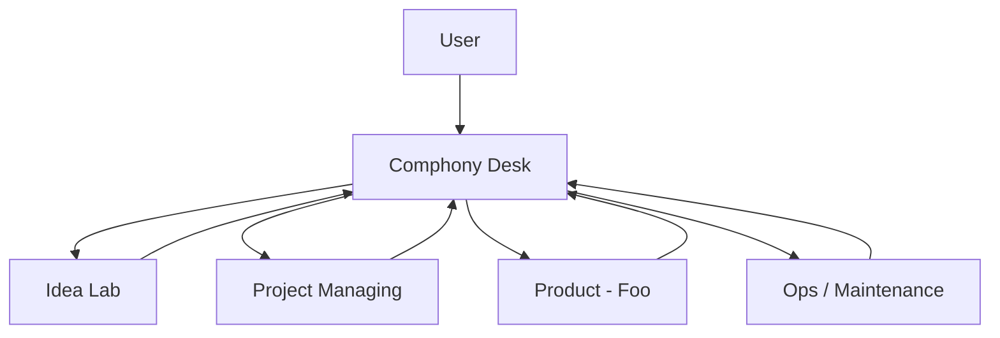

# Comphony Desk Model

이 문서는 `Comphony Desk`라는 단일 창구 프로젝트를 중심으로, 사람이 요청을 넣으면 AI 회사 구조가 그 요청을 분류하고 적절한 프로젝트로 전달한 뒤 다시 결과를 보고하는 운영 모델을 설명한다.

핵심 목표는 세 가지다.

- 사람은 어디에 요청해야 하는지 고민하지 않는다.
- 실행은 `Idea Lab`, `Project Managing`, `Product - <Name>` 같은 전문 프로젝트가 맡는다.
- 최종 결과 보고는 다시 하나의 부모 이슈로 모인다.

## 1. 왜 Desk가 필요한가

`Idea Lab`, `Project Managing`, `Product - <Name>`만 두면 실행 부서는 생기지만 사람 입장에서는 여전히 고민이 남는다.

- 이 요청은 아이디어인가, 개발인가, 프로젝트 생성인가
- 기획문서를 어디에 올려야 하는가
- 지금 어떤 하위 작업들이 진행 중인가
- 완료 결과를 어디에서 한 번에 볼 수 있는가

`Comphony Desk`는 이 문제를 해결하는 intake and routing 프로젝트다.

즉 Desk는:

- 사람과 직접 소통하는 유일한 창구
- 요청을 분류하는 triage 레이어
- 하위 프로젝트 이슈를 생성하는 coordinator
- 완료 결과를 다시 모아 보고하는 front office

중요한 점은 Desk가 직접 모든 작업을 하지 않는다는 것이다. Desk는 `실행`보다 `분류, 전달, 회수`를 담당한다.

## 2. 추천 회사 구조

가장 추천하는 구조는 아래와 같다.



이 구조에서 각 프로젝트의 역할은 다음과 같다.

| Linear 프로젝트 | 역할 | 주된 workflow 성격 | repo 필요성 |
| --- | --- | --- | --- |
| `Comphony Desk` | 사람 요청 intake, 분류, 위임, 결과 회수 | Desk workflow | 보통 없음 |
| `Idea Lab` | 아이디어 정리, PM, 리서치 | PM / Research workflow | 보통 없음 |
| `Project Managing` | 새 repo, 새 Linear 프로젝트, workflow 생성 | Project-admin workflow | 관리용 repo 선택 |
| `Product - <Name>` | 실제 설계/개발/검증 | PM / Research / Design / Dev workflow | 제품 repo 필요 |
| `Ops / Maintenance` | 운영, 유지보수, 장애/후속 작업 | Ops / Dev workflow | 운영 repo 선택 |

## 3. Desk 상태 체계

`Comphony Desk`는 일반 제품 프로젝트와 다른 상태 구조를 쓰는 편이 좋다. Desk의 상태는 실행 단계보다 `사람과의 커뮤니케이션 단계`를 표현해야 한다.

추천 상태는 아래와 같다.

| 상태 | 의미 | 누가 주로 처리하나 |
| --- | --- | --- |
| `Inbox` | 새 요청이 들어온 상태 | Desk workflow |
| `Clarifying` | 정보가 부족해서 짧은 질문이나 보완이 필요한 상태 | Desk workflow + 사람 |
| `Triaged` | 어디로 보낼지 결정됐고 하위 이슈를 만들고 있는 상태 | Desk workflow |
| `Waiting` | 하위 프로젝트에 위임되었고 결과를 기다리는 상태 | 하위 workflow |
| `Reported` | 하위 프로젝트 결과가 돌아왔고 최종 요약/회수가 필요한 상태 | Desk workflow |
| `Done` | 사용자 기준으로 요청이 종료된 상태 | Desk workflow 또는 사람 |
| `Canceled` | 중단된 상태 | 사람 또는 Desk workflow |

핵심 해석은 이렇다.

- `Inbox`는 사람 요청이 처음 닿는 곳이다.
- `Clarifying`은 Desk가 “이 정보 없이는 잘못 보낼 가능성이 크다”고 판단한 상태다.
- `Triaged`는 routing plan이 결정된 상태다.
- `Waiting`은 실제 작업을 하위 프로젝트가 하고 있다는 뜻이다.
- `Reported`는 하위 작업 결과가 부모 이슈로 돌아왔다는 뜻이다.

## 4. Desk workflow는 무엇을 해야 하나

Desk workflow는 코드 수정용 workflow가 아니다. 역할은 아래 네 가지다.

1. 요청을 요약하고 의도를 해석한다.
2. 어떤 프로젝트가 이 요청을 받아야 하는지 분류한다.
3. 필요한 하위 이슈를 생성하고 부모 Desk 이슈에 링크를 남긴다.
4. 하위 작업 결과가 오면 사람 눈높이의 최종 보고로 정리한다.

즉 Desk workflow는 "어디서 어떻게 일할지"보다 "누가 이 일을 맡아야 하는지"를 정하는 coordinator에 가깝다.

### 추천 활성 상태

Desk workflow는 보통 아래 상태만 직접 잡는 편이 안전하다.

- `Inbox`
- `Clarifying`
- `Triaged`
- `Reported`

`Waiting`은 보통 비활성 상태로 두고, 하위 이슈들이 끝날 때까지 부모 이슈를 잠시 멈춰두는 의미로 사용한다.

## 5. 라우팅 규칙

Desk는 요청을 아래처럼 분류하는 것이 가장 자연스럽다.

| 요청 유형 | 내려보낼 프로젝트 | 보통 시작 상태 |
| --- | --- | --- |
| 거친 아이디어, 기능 제안, 문제 정의 필요 | `Idea Lab` | `Planning` |
| 조사, 비교, 시장/기술 탐색 | `Idea Lab` | `Research` |
| 새 repo, 새 제품 프로젝트, workflow 세팅 | `Project Managing` | `Todo` |
| 이미 구현 가능한 기능 개발 | `Product - <Name>` | `Todo` |
| 제품 내 PM 정리 필요 | `Product - <Name>` | `Planning` |
| 운영성 작업, 정리, 유지보수 | `Ops / Maintenance` | `Todo` |

중요한 원칙:

- Desk 이슈는 `부모 이슈`로 남긴다.
- 실제 실행은 `하위 프로젝트 이슈`에서 한다.
- 하나의 Desk 요청이 여러 하위 이슈로 쪼개질 수 있다.

예:

- 하나의 PRD를 받았을 때
  - `Project Managing`에 제품 세팅 이슈 생성
  - `Idea Lab`에 PM kickoff 이슈 생성
  - 필요하면 `Product - Foo`에 초기 구현 이슈 생성

## 6. 부모-자식 이슈 구조

Desk 모델의 핵심은 `부모 Desk 이슈`와 `자식 실행 이슈`를 명시적으로 연결하는 것이다.

권장 규칙:

- 사람은 항상 `Comphony Desk`에 이슈를 만든다.
- Desk workflow는 하위 프로젝트에 새 이슈를 생성한다.
- 각 자식 이슈에는 `Desk Parent` 식별자를 남긴다.
- 부모 Desk 이슈에는 생성된 자식 이슈 목록과 목적을 정리한다.

권장 parent issue 기록 형식:

```md
## Delegation Plan

- Idea Lab / Planning
  - reason: PRD를 PM 관점에서 정리해야 함
  - child issue: TEAM-55
- Project Managing / Todo
  - reason: repo, Linear project, workflow를 생성해야 함
  - child issue: TEAM-56
```

권장 child issue 본문 형식:

```md
Desk Parent
- TEAM-14
- https://linear.app/your-workspace/issue/TEAM-14/...

Return Report
- when this task is complete, add a summary comment back to the Desk parent
- include created artifacts, exact paths, and next recommended lane
```

## 7. 자동 handoff와 자동 보고 규칙

Desk 모델에서 가장 중요한 계약은 `작업 완료 시 부모 Desk 이슈로 다시 보고한다`는 점이다.

최소 handoff 규칙은 아래와 같다.

### Desk -> Child

Desk workflow가 자식 이슈를 만들 때 반드시 남겨야 하는 것:

- 부모 Desk 이슈 식별자 또는 URL
- 왜 이 프로젝트로 보냈는지
- 기대 산출물
- 완료되면 부모 이슈에 무엇을 보고해야 하는지

### Child -> Desk

하위 workflow가 완료될 때 반드시 해야 하는 것:

- 부모 Desk 이슈에 결과 코멘트 작성
- 생성한 경로, 파일, 프로젝트, repo, 다음 추천 상태를 명시
- 부모 Desk 이슈를 `Waiting`에서 `Reported`로 올릴지 판단

### 언제 `Reported`로 올리나

- 이번 자식 이슈 결과만으로 사람이 이해 가능한 요약을 만들 수 있을 때
- 또는 마지막 필수 자식 이슈가 완료됐을 때

아직 다른 하위 이슈가 진행 중이면 부모는 `Waiting`에 두는 편이 낫다.

## 8. Project Managing 완료 후 Desk로 자동 보고하는 규칙

`Project Managing`는 Desk 모델에서 특히 중요하다. 새 제품을 세팅하면 사람은 다음 사실을 바로 알고 싶어한다.

- repo가 어디에 생성됐는지
- Linear 프로젝트 이름과 slug가 무엇인지
- workflow 파일이 어디에 생성됐는지
- 다음으로 PM이 받을 이슈가 무엇인지

따라서 `Project Managing` workflow에는 아래 규칙을 넣는 것이 좋다.

1. 자식 이슈 본문에서 `Desk Parent`를 찾는다.
2. 작업 완료 시 부모 Desk 이슈에 코멘트를 남긴다.
3. 코멘트에는 아래를 포함한다.
   - 생성된 repo 이름/경로
   - 생성된 Linear 프로젝트 이름/slug
   - 생성된 workflow 파일 경로
   - 다음 추천 이슈
4. 제품 세팅이 끝났으면 부모 Desk 이슈를 `Reported`로 옮기거나, 최소한 `Waiting` 상태 코멘트를 최신화한다.

권장 보고 포맷:

```md
## Project Managing Report

- Source child issue: PM-8
- Repo created: /Users/you/Documents/comphony/repos/product-foo
- Linear project created: Product - Foo (`abc123`)
- Workflow files created:
  - /Users/you/Documents/comphony/workflows/WORKFLOW.product-foo.pm.md
  - /Users/you/Documents/comphony/workflows/WORKFLOW.product-foo.dev.md
- Next recommended action:
  - create a PM kickoff issue in Idea Lab
  - or create the first Product - Foo implementation issue
```

## 9. 예시 흐름

### 예시 A. PRD를 주고 새 제품을 세팅하고 싶다

1. 사람이 `Comphony Desk`에 이슈 생성
2. 상태는 `Inbox`
3. Desk workflow가 PRD를 읽고 `Triaged`
4. Desk가 아래 자식 이슈 생성
   - `Project Managing / Todo`
   - `Idea Lab / Planning`
5. 부모 Desk 이슈는 `Waiting`
6. `Project Managing`가 repo, Linear project, workflow 생성 후 Desk 부모에 보고
7. `Idea Lab`이 PM 정의를 정리하고 Desk 부모에 보고
8. Desk workflow가 두 결과를 모아 `Reported`
9. 최종 요약 후 `Done`

### 예시 B. 이미 제품이 있고 기능 하나 개발하고 싶다

1. 사람이 `Comphony Desk`에 요청
2. Desk가 구현 가능 여부를 판단
3. 모호하면 `Idea Lab / Planning`으로 보냄
4. 명확하면 `Product - Foo / Todo`로 자식 이슈 생성
5. 개발 완료 후 Product workflow가 Desk 부모에 보고
6. Desk가 사람에게 한글 요약으로 결과를 정리하고 종료

## 10. 기본 추천

초기 기본 회사 구조는 아래를 권장한다.

- `Comphony Desk`
- `Idea Lab`
- `Project Managing`
- `Product - Core`

운영 원칙은 간단하다.

- 사람은 `Comphony Desk`만 사용한다.
- 실행은 전문 프로젝트가 맡는다.
- 모든 최종 보고는 다시 `Comphony Desk`로 회수한다.
