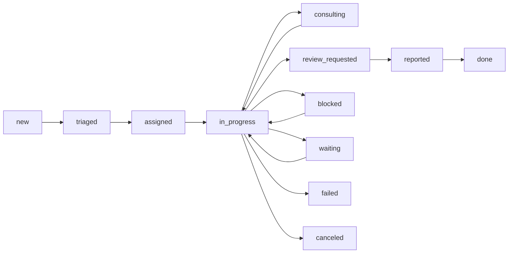

# Comphony Execution State Machine

This document defines the recommended execution state model for tasks in `Comphony`.

The goal is to model actual company work, including:

- assignment
- handoff
- consultation
- review
- blocking
- retry
- abandonment
- human takeover

## 1. Why This Matters

Without an explicit execution state machine, task handling becomes inconsistent and hard to recover when something fails.

## 2. Primary Task States

Recommended primary states:

- `new`
- `triaged`
- `assigned`
- `consulting`
- `waiting`
- `in_progress`
- `review_requested`
- `blocked`
- `reported`
- `done`
- `canceled`
- `failed`

## 3. State Intent

### new

Task exists but has not been classified yet.

### triaged

Task has been interpreted and routed, but no active owner has started work.

### assigned

An owner exists.

### consulting

The main owner is still active, but is waiting on another agent's answer.

### waiting

Task is paused pending something external:

- user reply
- sync
- approval
- dependency

### in_progress

Active execution is happening.

### review_requested

Execution is complete enough for review.

### blocked

Execution cannot continue without intervention.

### reported

A result exists and has been sent back to the parent or user-facing thread.

### done

Task is fully complete.

### canceled

Task was intentionally stopped.

### failed

Task stopped because execution failed and no automatic recovery succeeded.

## 4. Secondary Lifecycle Flags

Some behavior should be modeled as flags or side states, not only a single status.

Examples:

- `needs_approval`
- `retryable`
- `external_sync_pending`
- `human_takeover`
- `has_open_review`

## 5. Required Transitions

Recommended common transitions:



## 6. Recovery States

The runtime should explicitly support recovery behavior.

Examples:

- `blocked -> in_progress`
- `failed -> triaged`
- `failed -> human_takeover`
- `review_requested -> in_progress`

This matters because real work often loops.

## 7. Handoff Semantics

Handoff should not always mean full task state change.

There are two forms:

### ownership_handoff

Primary owner changes.

### consultation_handoff

Owner stays the same, but another actor is consulted.

These should be modeled distinctly.

## 8. Review Semantics

Review should not be equivalent to done.

Review means:

- the work is ready for inspection
- a reviewer has been requested
- the task may return to `in_progress`

## 9. Human Takeover

The system should support explicit human takeover.

This is needed when:

- an agent is stuck
- confidence is low
- permissions are insufficient
- the user wants direct control

Suggested flag:

```yaml
human_takeover:
  active: true
  requested_by: ...
  reason: ...
```

## 10. Timeouts And Retries

The runtime should define policies for:

- consultation timeout
- review timeout
- sync timeout
- execution retry limit

This does not need exact durations in this document, but the policy shape must exist.

## 11. Product Rule

Tasks should not disappear into silent failure.

Every task should always be in a state that answers:

- who owns it
- what it is waiting on
- whether it is blocked
- whether it needs review
- whether it can recover

That is the operational standard the runtime should meet.
