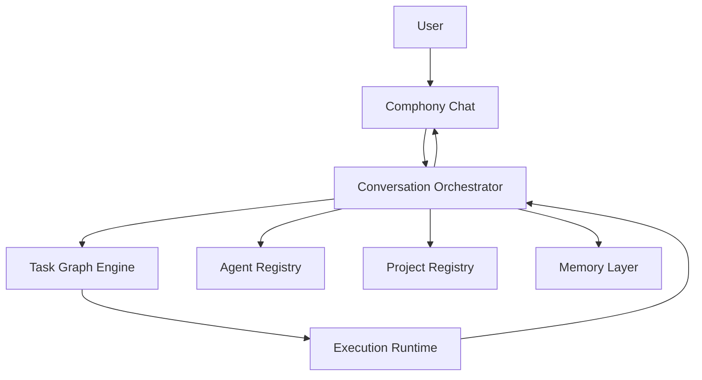

# Comphony Final Architecture

This document defines the recommended final architecture direction for `Comphony`.

It is the strongest version of the product model discussed so far.

The key shift is this:

- not project-board first
- not workflow-file first
- not Linear-first

Instead:

- conversation first
- task graph first
- agent registry first
- local runtime first

## 1. Final Product Shape

The final product should behave like a company operating system.

The user should experience:

- one company to talk to
- one place to ask what is happening
- visible delegation between agents
- visible review and consultation chains
- searchable memory across previous work

The internal structure should support:

- agents
- projects
- tasks
- threads
- handoffs
- reviews
- memory
- runtime execution

## 2. The Final Core

The final core of the system should be:

This is a stronger center of gravity than:

- project states
- workflow templates
- task boards

Those can still exist, but they should not define the product.

## 3. The Key Architectural Decision

The central unit of the system should be a `conversation-linked task graph`.

That means:

- every request begins in a thread
- a thread may create one or more tasks
- tasks may create handoffs, reviews, and consultations
- artifacts and memory attach to those tasks
- results flow back into the same user-facing thread

This makes the system dynamic and explainable.

## 4. Major Layers

## 4.1 Comphony Chat

The user-facing entry point.

Responsibilities:

- accept natural language requests
- expose follow-up conversation
- show progress and results
- allow direct conversation with specific agents
- allow interruption and redirection

## 4.2 Conversation Orchestrator

This is the actual "brain" of `Comphony`.

Responsibilities:

- interpret the current message
- decide whether to answer immediately or create/change work
- call the routing policy
- retrieve relevant memory
- create or update task graph nodes
- assemble final responses back to the user

This layer should eventually replace the idea that the user is "talking to a workflow."

## 4.3 Task Graph Engine

This should replace flat issue-only thinking.

Responsibilities:

- create tasks
- create parent/child relationships
- create handoffs
- create consultations
- create review requests
- track blockers
- track next-owner suggestions

The graph is what makes agent collaboration visible and programmable.

## 4.4 Agent Registry

This should model workers, not just prompts.

Responsibilities:

- store agent identities
- store capabilities and tools
- store which projects and lanes an agent can work in
- store handoff and review permissions
- store install source for imported agents

## 4.5 Project Registry

This should model the work environment.

Responsibilities:

- store repo and runtime configuration
- track assigned agents
- track allowed lanes
- track project memory and policy

## 4.6 Memory Layer

This is the continuity layer of the company.

Responsibilities:

- save decisions
- save summaries
- save artifact references
- save learned patterns
- support retrieval by user and by agents

## 4.7 Execution Runtime

This is the part that actually does work.

Responsibilities:

- invoke Codex
- invoke Symphony where still useful
- manage repos and workspaces
- run tests
- build artifacts
- execute lane-specific actions

This should remain local-first.

## 4.8 Sync And Realtime Layer

This is the bridge between web clients and the local runtime.

Recommended role:

- auth
- event storage
- realtime subscriptions
- mobile/browser access

This layer should not become the primary execution brain.

## 5. Recommended Runtime Principle

The local runtime should be the execution authority.

That means:

- local server owns live execution
- local repos remain accessible
- the user's private environment stays under local control
- the web UI acts as a control surface

This is a better fit than forcing all product logic into a cloud app.

## 6. The Strongest Abstractions

The abstractions that should survive long term are:

- `Company`
- `Agent`
- `Project`
- `Thread`
- `Task`
- `Handoff`
- `Consultation`
- `Review`
- `Artifact`
- `Memory`

The abstractions that should become secondary are:

- workflow file
- shell helper
- task board state
- one specific tracker integration

## 7. Why This Structure Is Better

This structure is better because it directly supports the product promise:

- a user can ask one company for outcomes
- the company can delegate internally
- agents can talk to each other
- the user can ask what is happening
- previous work can be recalled

In other words, it models a company, not just an automation chain.

## 8. How Old Structures Fit Into The New One

Existing concepts still matter, but in a smaller role.

### Linear

Should become:

- an external tracker
- a sync target
- a mirrored board for teams that still want one

### Workflow files

Should become:

- generated runtime configuration
- lane definitions
- execution adapters

### Desk

Should become:

- an internal routing layer
- not the whole user-facing brand

### Projects like Idea Lab or Project Managing

Should become:

- lanes or departments in the larger company graph
- useful, but not the core product identity

## 9. The Final Rule

If a new feature reinforces:

- conversation
- delegation
- visibility
- memory
- local control
- flexible agent composition

then it fits the product.

If it mainly reinforces:

- static board routing
- hand-edited scripts
- fixed project-state logic

then it is probably part of the old prototype and should be treated carefully.
