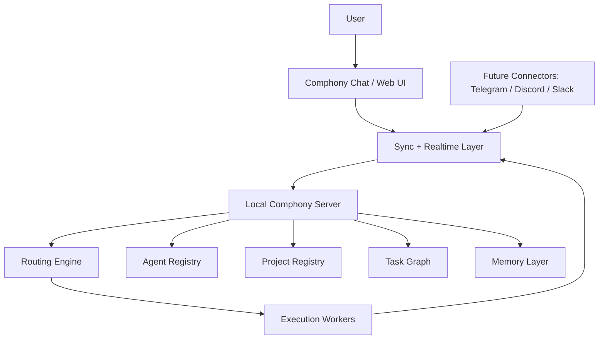

# Comphony System Architecture

This document defines the target system architecture for `Comphony`.

It reflects the newer product direction:

- local-first runtime
- web-based control surface
- conversational entry point
- dynamic agent registry
- project and task orchestration
- optional external connectors

## 1. Architecture Goal

The system should let a user operate a company of AI agents from one conversational front door while keeping the actual execution runtime under the user's control.

## 2. High-Level Model

## 3. Why Local-First

The execution runtime should stay local-first because:

- agents may need access to local repos and files
- the user may want full control over keys and infrastructure
- repo bootstrap, test runs, and workflow execution often happen on the user's own machine or server
- this keeps the product usable even when the cloud side is only a sync/control plane

The cloud-facing layer should assist with:

- realtime sync
- web/mobile access
- auth
- notifications
- remote observation

## 4. Main Components

## 4.1 Comphony Chat

The user-facing front door.

Responsibilities:

- receive user requests
- display responses
- let the user ask status and history questions
- allow direct messaging to named agents
- display ongoing work, reviews, and blockers

## 4.2 Sync + Realtime Layer

This is the bridge between the web UI and the local runtime.

Supabase is a good candidate here because it provides:

- auth
- postgres
- realtime subscriptions
- webhook-friendly integrations

Responsibilities:

- store user messages and task events
- broadcast state changes to the UI
- relay chat/events between clients and the local runtime

## 4.3 Local Comphony Server

This is the main runtime.

Responsibilities:

- own the live company state
- run routing logic
- invoke Codex/Symphony/workflow runners
- manage local repos and workspaces
- manage agent availability and execution
- read and write memory

This should become the real backend of the system.

## 4.4 Routing Engine

This layer determines:

- what the user is asking for
- whether the request needs planning, research, design, implementation, provisioning, or ops
- which agent or lane should receive the work
- whether the work should split into sub-tasks

The routing engine must become config-backed rather than prompt-only.

## 4.5 Agent Registry

This is a first-class object in the product, not just a prompt folder.

Each agent should have metadata such as:

- id
- display name
- role
- capabilities
- tools
- project memberships
- handoff permissions
- review permissions
- memory scope
- prompt or skill package

## 4.6 Project Registry

Projects should also be first-class.

Each project should define:

- name
- purpose
- linked repo(s)
- active agents
- task policies
- review policies
- connected runtime/workflow settings

## 4.7 Task Graph

Tasks should be modeled as more than flat tickets.

The system should support:

- parent tasks
- child tasks
- assigned owner
- requested reviewer
- consultation links
- blocking relationships
- next recommended owner

This is how the product becomes dynamic rather than static.

## 4.8 Memory Layer

The memory layer should support at least:

- company memory
- project memory
- agent memory
- task memory

It should answer questions like:

- what was done before
- who made a decision
- why that decision was made
- what related work exists

## 5. Key Runtime Entities

The architecture should revolve around these entities.

### Agent

Represents a worker.

### Project

Represents a product or operating lane.

### Task

Represents a unit of work.

### Thread

Represents a conversation between user and company, or agent and agent.

### Handoff

Represents a delegation from one actor to another.

### Review

Represents a required check before closure.

### Memory Item

Represents reusable knowledge.

## 6. Dynamic Agent Hiring

The system should support importing agent definitions from external metadata sources.

That means a future architecture should support something like:

- hosted registry of agent templates
- link-based install
- project-local activation

Example flow:

1. user browses a public `Comphony Registry`
2. user selects a design agent template
3. local server imports the metadata
4. the agent is added to the registry
5. the user assigns that agent to a project

This turns "prompt files" into a real hiring model.

## 7. Internal Versus External Truth

The system should distinguish between:

- internal source of truth
- synced external systems

Recommended direction:

- `Comphony` internal state becomes the primary source of truth
- external systems like Linear become sync targets or mirrors when needed

That is a major step beyond the earlier "Linear-first" design.

## 8. Channel Connectors

External channels should become adapters into the same task and conversation system.

Future connectors:

- Telegram
- Discord
- Slack

Important principle:

- these channels should not create their own logic silos
- they should feed the same conversation/task engine

## 9. Interface Layers

The product should likely develop in these interface layers:

### Layer 1: Local Web Console

Primary shipping UI.

### Layer 2: Mobile-Friendly Web

Responsive and touch-friendly.

### Layer 3: External Chat Connectors

Telegram, Discord, Slack.

## 10. Core Architectural Shift

The main architectural shift from the earlier system is:

- from static workflow routing
- to dynamic company orchestration

Old center of gravity:

- Linear projects
- workflow files
- issue states

New center of gravity:

- company chat
- agents
- projects
- tasks
- handoffs
- reviews
- memory

## 11. Recommended Technical Layers

The most practical stack direction is:

- frontend web app
  - React or Next.js
- sync/control plane
  - Supabase
- local runtime daemon
  - `comphony server`
- local execution integrations
  - Codex
  - Symphony
  - workflow runners
- storage
  - local config + local runtime state
  - synced event/state tables in postgres

## 12. Architectural Priorities

The architecture should optimize for:

1. local control
2. conversational simplicity
3. agent flexibility
4. visible collaboration
5. reproducible runtime setup
6. extensibility to new channels and agents

If those hold, the system can grow without collapsing back into static workflow glue.
