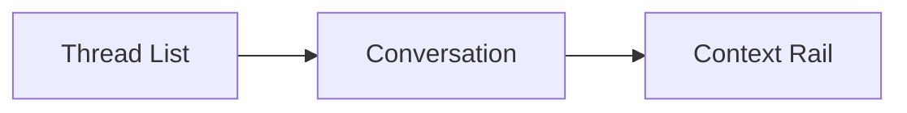

# Comphony UI Information Architecture

This document defines the recommended information architecture for the `Comphony` product UI.

The product should not feel like a board-first task manager.
It should feel like a conversational company console.

## 1. Design Principle

The UI should answer four user needs first:

- talk to the company
- understand what is happening
- inspect the workers
- recover memory

That means the top-level IA should not start with `Projects` or `Boards`.

## 2. Recommended Top-Level Navigation

Recommended primary navigation:

- `Chat`
- `Work`
- `Agents`
- `Memory`
- `Projects`

Recommended secondary/admin navigation:

- `Registry`
- `Settings`
- `Connectors`

## 3. Why This IA Is Better

This order matches the product promise.

### Chat first

Because the user should start by talking to `Comphony`.

### Work second

Because after asking for work, the user wants to inspect progress.

### Agents third

Because the product is an agent company, not just a board.

### Memory fourth

Because historical recall is a core advantage.

### Projects fifth

Projects matter, but they should not dominate the experience.

## 4. Main Screens

## 4.1 Chat

Purpose:

- main command surface
- conversational intake
- status Q&A
- result delivery

Key UI regions:

- conversation list
- active conversation panel
- context rail showing linked tasks, active agents, and artifacts

Useful actions:

- ask Comphony
- mention a specific agent
- approve next action
- redirect work
- ask for explanation

## 4.2 Work

Purpose:

- monitor the live task graph

Key views:

- active tasks
- blocked tasks
- handoff queue
- review queue
- recently completed tasks

Important grouping options:

- by project
- by owner
- by lane
- by status

## 4.3 Agents

Purpose:

- inspect, hire, assign, and manage workers

Key views:

- all agents
- available agents
- overloaded agents
- project-specific roster
- agent detail page

Agent detail should show:

- role
- capabilities
- current work
- recent completed work
- who they can hand off to
- who can review them
- memory summary

## 4.4 Memory

Purpose:

- make the company's knowledge searchable

Key views:

- company memory
- project memory
- agent memory
- task-linked memory

Useful filters:

- tags
- project
- agent
- artifact type
- decision type

## 4.5 Projects

Purpose:

- manage company workspaces, repos, and assigned teams

Project detail should show:

- project purpose
- linked repo(s)
- assigned agents
- current tasks
- review policy
- memory summary

## 4.6 Registry

Purpose:

- browse installable agents, skills, and templates

This is where the future hiring/marketplace story lives.

## 5. Mobile UX

The first mobile-friendly cut should prioritize:

- chat
- active task list
- approvals/review actions
- direct status lookup

Do not try to bring the full admin console to mobile first.

Mobile core jobs:

- send work
- ask what is happening
- approve or redirect
- read the result

## 6. Chat Thread Structure

The most important screen is the active chat thread.

Recommended layout:

### Thread List

Shows:

- recent conversations
- unread updates
- linked tasks count
- blocked indicator

### Conversation

Shows:

- user messages
- Comphony responses
- agent replies
- system status updates

### Context Rail

Shows:

- active task(s)
- current owner(s)
- handoffs
- review requests
- artifacts
- memory references

## 7. Work Screen Structure

Recommended sub-tabs:

- `Active`
- `Blocked`
- `Review`
- `Completed`

Recommended default card fields:

- task title
- project
- current owner
- current lane
- status
- waiting on
- latest event

## 8. Agent Screen Structure

Recommended sub-tabs:

- `All`
- `Assigned`
- `Available`
- `Templates`

Agent card should show:

- name
- role
- top capabilities
- current load
- current active task count
- last completed task

## 9. Memory Screen Structure

Recommended sub-tabs:

- `Recent`
- `Company`
- `Projects`
- `Agents`
- `Artifacts`

The memory search experience should feel closer to "ask the company what it knows" than to raw database search.

## 10. First UI Rule

If the interface is forcing the user to think in:

- workflow files
- state machine internals
- project routing mechanics

then the product is exposing too much of the prototype.

If the interface lets the user think in:

- people
- work
- questions
- results
- history

then it is much closer to the right product.
