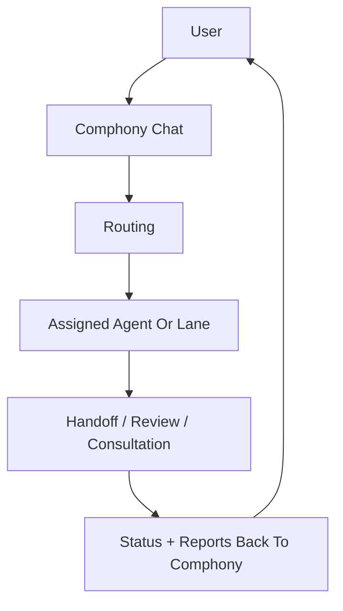

# Comphony User Experience

This document defines the intended user experience of `Comphony`.

It focuses on how the user should interact with the system, not on internal implementation details.

## 1. The Main User Model

The main user model should be simple:

- the user talks to `Comphony`
- `Comphony` routes work to agents
- the user can inspect, interrupt, redirect, or ask follow-up questions at any time

The user should not need to understand:

- workflow files
- routing rules
- project-state topology
- which shell helper exists

Those are internal mechanics.

## 2. The Primary Experience

The primary experience should feel like operating a company through one conversation.

Example:

1. The user says: "Build me a dashboard for this product idea."
2. `Comphony` decides whether planning, research, design, project setup, or implementation is required.
3. The system delegates that work.
4. The user sees live progress.
5. The user can ask:
   - "What are you doing?"
   - "Who is blocked?"
   - "What did the design agent recommend?"
   - "What happened last time?"
6. `Comphony` reports the result in plain language.

## 3. Modes Of Interaction

The product should support four user interaction modes.

### 3.1 Ask Comphony

The default mode.

The user talks to the company as one entity.

Examples:

- "Set up a new product from this PRD."
- "Improve the dashboard UX."
- "Who should handle this next?"
- "What happened with yesterday's task?"

### 3.2 Talk To A Specific Agent

The user can directly talk to a worker when needed.

Examples:

- "@Mina review the design direction."
- "@Researcher compare three competitor dashboards."
- "@Dev explain why this task is blocked."

### 3.3 Inspect Company State

The user can ask status questions instead of digging through boards.

Examples:

- "What is everyone working on?"
- "Which tasks are waiting for review?"
- "Who is overloaded?"
- "Which product is behind?"

### 3.4 Ask About Memory

The user can retrieve the company's past decisions and work.

Examples:

- "Who worked on the dashboard redesign before?"
- "What did we decide about the landing page CTA?"
- "Show me previous research on admin UI patterns."

## 4. The Core Surfaces

The product should ultimately feel like one integrated operating console with multiple views.

### 4.1 Chat

The main conversation surface.

This is where the user:

- submits requests
- asks questions
- interrupts ongoing work
- redirects or approves next steps

### 4.2 Work

A real-time view of tasks, handoffs, reviews, and blockers.

This is where the user sees:

- current task owner
- waiting dependencies
- review queue
- completion status

### 4.3 People

A view of the company's workers.

This is where the user sees:

- who exists
- what each agent is good at
- what each agent is doing
- which projects each agent belongs to

### 4.4 Projects

A view of the company's active products, lanes, and environments.

### 4.5 Memory

A searchable view of company knowledge.

## 5. The Desired Feeling

The UI should make the user feel:

- confident that work is moving
- able to intervene without friction
- aware of delegation and collaboration
- in control without micromanaging execution

The product should not feel like:

- a static kanban board
- a hidden automation pipeline
- a prompt graveyard

## 6. The Default Flow

The default flow should be:

The key requirement is that the user does not have to manually manage the middle of this flow unless they choose to.

## 7. The Advanced Flow

The system should also support deeper company-like collaboration.

Examples:

- an agent can consult another agent
- an agent can ask for review
- an agent can escalate to the user
- an agent can suggest a better next owner
- a task can split into child tasks

That means the product needs to support:

- delegation
- consultation
- review
- escalation
- memory lookup

## 8. The Mobile Reality

The default runtime may be local, but the user should still be able to:

- send work to Comphony from mobile
- ask for status from mobile
- approve or redirect a task from mobile
- receive a result from mobile

This implies:

- a responsive web UI at minimum
- real-time sync between the local runtime and a remote control plane

## 9. External Channels

External chat channels should be treated as future connectors, not the primary architecture.

Potential connectors:

- Telegram
- Discord
- Slack

These should feed into the same `Comphony Chat` model rather than becoming separate product logic.

## 10. UX Principles

### 10.1 Conversation First

The user should always be able to express intent in natural language.

### 10.2 Structured Transparency

The system should make delegation and progress visible without overwhelming the user with raw internal detail.

### 10.3 Interruptibility

The user should be able to jump in at any time and steer work.

### 10.4 Explainability

The user should be able to ask:

- why something was assigned
- why something is blocked
- why a recommendation was made

### 10.5 Composability

The user should be able to hire new agents, add new projects, and reshape the company as needed.

## 11. Success Criteria

The user experience is working when:

- the user knows to start by talking to `Comphony`
- the user can get work moving without selecting internal workflow details
- the user can inspect and redirect work without losing context
- the user can directly talk to agents when needed
- the user can recover past work through memory

If those things are true, the product is behaving like a company operating system instead of a static automation stack.
