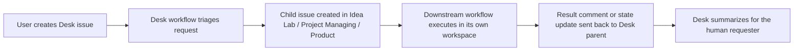

# Issue Lifecycle

이 문서는 다음 질문에 답하기 위해 작성되었다.

- Linear 이슈가 생성된 뒤 Symphony는 어떻게 그 이슈를 처리하는가
- Workflow 파일은 정확히 어떤 역할을 하는가
- 대상 repo가 있는 코드 작업과, repo가 없는 research 작업은 무엇이 다른가
- project-admin 같은 메타 작업은 어떤 식으로 돌아가는가
- 사람과 한 창구로 소통하는 `Desk` 프로젝트를 둘 때 흐름은 어떻게 달라지는가

이 문서는 "이슈 생성 시점부터 처리 완료까지"의 흐름을 설명한다.

## 1. 먼저 구분해야 할 4가지

Symphony를 이해할 때 헷갈리는 것은 아래 4가지가 서로 다른 역할을 한다는 점이다.

### 1. Linear

Linear는 작업 지시와 상태 관리가 일어나는 곳이다.

- 어떤 작업을 할지 적는다
- 상태를 `Todo`, `In Progress`, `Done` 등으로 관리한다
- 작업 도중 메모, 결과, handoff를 남긴다

즉 Linear는 "무슨 일을 할지"와 "현재 어디까지 왔는지"를 표현하는 시스템이다.

### 2. Workflow 파일

Workflow 파일은 Symphony의 실행 정책 파일이다.

- 어떤 Linear 프로젝트를 볼지
- 어떤 상태를 처리 대상으로 볼지
- workspace를 어디에 만들지
- 새 workspace에 무엇을 준비할지
- 어떤 역할로 행동할지

즉 workflow는 "어디서 어떻게 일할지"를 정한다.

### 3. 대상 repo 또는 관리용 repo

repo는 작업에 필요한 실제 파일의 원본이다.

예:

- 제품 코드 repo
- 디자인 시스템 repo
- 운영 자동화 repo
- project-admin repo

이 repo는 workflow의 `after_create`에서 workspace 안으로 복제되거나 worktree로 연결된다.

### 4. Workspace

workspace는 이슈별 실제 작업 폴더다.

여기서 진짜 작업이 일어난다.

- 코드 파일 수정
- 조사 노트 작성
- 보고서 생성
- 스크립트 실행

즉 원본 repo가 아니라, 이슈 전용 작업 복제본 또는 작업 공간이다.

## 2. 전체 흐름 한눈에 보기

```mermaid
flowchart LR
    A["Linear Issue Created"] --> B["Symphony Polls Project"]
    B --> C["Workflow Matches Project + State"]
    C --> D["Workspace Created"]
    D --> E["after_create Prepares Repo or Notes Folder"]
    E --> F["Codex Runs With Workflow Prompt"]
    F --> G["Files / Notes / Reports Updated In Workspace"]
    G --> H["Linear Workpad / State Updated"]
    H --> I["Human Review / Done / Next Role State"]
```



핵심은 이렇다.

- Linear는 이슈를 만든다
- Symphony는 그 이슈를 발견한다
- Workflow는 어디서 어떤 방식으로 처리할지 정한다
- 실제 작업은 workspace에서 일어난다
- 결과는 다시 Linear에 반영된다

## 2.5. Desk를 앞단에 두는 경우

사람이 여러 프로젝트 중 어디에 이슈를 넣어야 할지 고민하지 않게 하려면 `Comphony Desk`를 맨 앞에 두는 것이 좋다.

이 경우 전체 흐름은 아래처럼 바뀐다.



핵심 차이:

- 사람은 `Desk` 프로젝트에만 이슈를 만든다.
- Desk workflow는 실제 실행을 하지 않고 `routing`을 한다.
- 실제 작업은 하위 프로젝트 이슈가 담당한다.
- 완료 보고는 부모 Desk 이슈로 다시 회수된다.

## 3. 코드 작업 이슈는 어떻게 처리되는가

예:

- "대시보드에 last refresh 시간 추가"
- "로그인 오류 수정"
- "설정 페이지 카드 추가"

### 단계별 흐름

1. 사용자가 Linear 프로젝트에 이슈를 만든다.
2. 이슈 상태를 workflow가 보는 상태로 둔다.
   - 예: `Todo`
3. Symphony가 해당 `project_slug`와 `active_states`에 맞는 이슈를 발견한다.
4. Symphony가 이슈 ID 기반 workspace를 만든다.
   - 예: `/Users/you/Documents/comphony/workspaces/product-foo/FOO-12`
5. Workflow의 `hooks.after_create`가 실행된다.
   - 예: repo clone
   - 예: `pnpm install`
6. Workflow 본문 prompt와 이슈 내용이 합쳐져 Codex에 전달된다.
7. Codex가 workspace 안의 파일을 수정한다.
8. 테스트나 검증 명령을 실행한다.
9. Linear workpad comment와 상태를 업데이트한다.
10. 완료되면 `Human Review` 또는 `Done` 같은 다음 상태로 이동한다.

### 이때 무엇이 어디에 있나

- 이슈 설명: Linear에 있음
- 실행 정책: workflow 파일에 있음
- 원본 코드: 대상 repo에 있음
- 실제 수정본: workspace에 있음

### 중요한 포인트

Symphony는 "원본 repo를 바로 수정"하는 것이 아니라, 보통 "이슈별 workspace clone" 안에서 수정한다.

## 4. research 이슈는 어떻게 처리되는가

예:

- "Sentry와 Bugsnag 비교 조사"
- "React 상태관리 옵션 조사"
- "경쟁사 onboarding UX 분석"

이런 경우는 코드 repo가 아예 필요 없을 수도 있다.

### 흐름 차이

코드 작업과 비교했을 때 가장 큰 차이는 `after_create`다.

코드 작업:

```yaml
hooks:
  after_create: |
    git clone --depth 1 --branch main file:///Users/you/Documents/comphony/repos/product-foo .
    pnpm install --frozen-lockfile
```

research 작업:

```yaml
hooks:
  after_create: |
    mkdir -p notes output sources
```

즉 research workflow에서는 workspace가 "코드 수정용 clone"이 아니라 "조사 전용 작업 폴더"가 된다.

### 단계별 흐름

1. 사용자가 Research 프로젝트 또는 Research 상태의 이슈를 만든다.
2. Symphony가 research workflow로 이슈를 잡는다.
3. 빈 workspace 또는 notes/output 폴더가 준비된다.
4. Codex가 조사, 비교, 정리를 수행한다.
5. 결과를 markdown 보고서, workpad comment, 요약 노트로 남긴다.
6. 준비가 되면 `Design` 또는 `Todo` 같은 다음 상태로 넘긴다.

### 이 경우 repo는 꼭 필요한가

아니다.

research 이슈는 다음 셋 중 하나로 처리할 수 있다.

- repo 없이 빈 workspace
- 문서 템플릿만 있는 workspace
- 참고 자료가 들어 있는 knowledge repo를 clone한 workspace

## 5. PM / Design / Research / Dev 역할 분리 작업은 어떻게 처리되는가

이 경우는 보통 "같은 이슈를 여러 에이전트가 동시에 본다"기보다, "상태 기반 릴레이"로 처리한다.

예를 들어 같은 Linear 프로젝트에서 이렇게 운영할 수 있다.

- `Planning`
- `Research`
- `Design`
- `Todo`
- `In Progress`
- `Human Review`
- `Done`

그리고 workflow를 이렇게 나눈다.

- PM workflow -> `Planning`
- Research workflow -> `Research`
- Design workflow -> `Design`
- Dev workflow -> `Todo`, `In Progress`, `Rework`

### 흐름 예시

1. PM workflow가 `Planning` 이슈를 잡는다.
2. 요구사항과 acceptance criteria를 정리한다.
3. 상태를 `Research`나 `Design` 또는 `Todo`로 바꾼다.
4. 다음 상태를 담당하는 workflow가 이어서 잡는다.
5. 최종적으로 Dev workflow가 코드 작업을 수행한다.

즉 역할 분리는 workflow 중첩이라기보다 `이슈 상태 릴레이`에 가깝다.

## 6. project-admin 같은 메타 작업은 어떻게 처리되는가

예:

- 새 repo 생성
- 새 Linear 프로젝트 생성
- 새 workflow 템플릿 생성
- 새 프로젝트 bootstrap 문서 생성

이 경우는 보통 일반 제품 repo가 아니라 관리용 repo를 하나 둔다.

예:

- 관리용 repo: `project-admin`
- 관리용 Linear 프로젝트: `Project Managing`
- 관리용 workflow: `WORKFLOW.project-admin.md`

### 흐름

1. 사용자가 관리용 Linear 프로젝트에 이슈를 만든다.
2. Symphony가 관리용 workflow로 그 이슈를 잡는다.
3. 관리용 repo를 workspace에 준비한다.
4. 스크립트나 템플릿을 사용해 새 repo / 새 Linear 프로젝트 / 새 workflow를 만든다.
5. 결과 경로와 생성 결과를 workpad에 기록한다.

즉 이 경우도 구조는 같다. 다만 "작업 대상"이 제품 코드가 아니라 운영/프로비저닝 작업일 뿐이다.

### Desk와 함께 쓰는 경우

`Project Managing`가 `Desk`의 child issue로 생성되는 경우를 권장한다.

이때 child issue에는 아래가 들어가야 한다.

- `Desk Parent` 식별자 또는 URL
- 완료 시 부모 Desk 이슈에 무엇을 보고할지
- 생성해야 하는 repo / 프로젝트 / workflow 이름

작업 완료 후에는 다음이 부모 Desk 이슈로 돌아와야 한다.

- 생성된 repo 경로
- 생성된 Linear 프로젝트 이름과 slug
- 생성된 workflow 파일 경로
- 다음 추천 작업

## 7. 이슈 생성 시점에서 실제로 무엇을 적어야 하나

### 코드 작업 이슈

이슈에는 보통 아래를 적는다.

- 목표
- 범위
- 기대 결과
- 검증 방법

예:

```md
Title: Add last refresh label to dashboard

Goal:
Show when the dashboard snapshot was last generated.

Scope:
- update dashboard UI
- keep change small

Validation:
- dashboard loads at /
- focused dashboard tests pass
```

### Desk intake 이슈

사람이 직접 여러 실행 프로젝트를 고르는 대신 Desk에 넣고 싶다면, 이슈에는 아래가 들어가면 충분하다.

- 무엇을 원하는지
- 이미 있는 기획문서나 PRD
- 원하는 최종 상태
- 누가 후속으로 처리해야 할지 아직 확실하지 않다는 점

예:

```md
Title: Turn this PRD into a real project

Goal:
Set up a new product from the attached planning document.

Source:
- /absolute/path/to/prd.md

Desired outcome:
- repo exists
- Linear product project exists
- workflows exist
- next PM or dev issue is ready
```

### research 이슈

예:

```md
Title: Research frontend error monitoring options

Goal:
Compare Sentry, Bugsnag, and Rollbar.

Output:
- markdown comparison report
- pricing summary
- recommendation
```

### project-admin 이슈

예:

```md
Title: Bootstrap repo_foo project

Tasks:
- create Git repo `repo_foo`
- create Linear project `Repo Foo`
- generate `WORKFLOW.repo_foo.md`
- prepare `/Users/you/Documents/comphony/workspaces/repo_foo`
```

즉 이슈 내용은 작업 지시서이고, workflow는 실행 환경 설정서다.

## 8. "workflow repo"라는 표현은 무엇을 의미하나

실제로는 두 가지 뜻으로 쓰일 수 있다.

### 1. 대상 작업 repo

제품 코드가 들어 있는 repo다.

예:

- `repo_a`
- `repo_b`

이 경우 workflow는 그 repo를 workspace에 가져오도록 설정된다.

### 2. 관리용/보조용 repo

운영 스크립트, 템플릿, 문서, provisioning 로직을 담아둔 repo다.

예:

- `project-admin`
- `workflow-templates`

이 경우 workflow는 제품 기능이 아니라 "새 프로젝트 생성" 같은 메타 작업을 수행한다.

즉 "workflow repo"는 제품 repo일 수도 있고, 관리용 repo일 수도 있다.

## 9. 어떤 workflow가 어떤 이슈를 잡는가

결정 기준은 보통 다음 셋이다.

- `tracker.project_slug`
- `tracker.active_states`
- 필요하면 `tracker.assignee`

즉 같은 Linear 조직을 보더라도:

- 어떤 프로젝트인지
- 어떤 상태인지
- 누구에게 할당된 이슈인지

에 따라 다른 workflow가 다른 이슈를 잡게 할 수 있다.

## 10. 같은 Linear 프로젝트를 여러 workflow가 볼 수 있는가

가능하다.

다만 안전하게 하려면 같은 상태를 겹치게 보면 안 된다.

좋은 예:

- PM workflow -> `Planning`
- Research workflow -> `Research`
- Design workflow -> `Design`
- Dev workflow -> `Todo`, `In Progress`

나쁜 예:

- PM workflow와 Dev workflow가 둘 다 `Todo`를 봄

## 11. 실전에서 가장 이해하기 쉬운 운영 모델

### 모델 A. repo별 단순 운영

- repo 1개
- Linear 프로젝트 1개
- dev workflow 1개

이건 가장 단순하다.

### 모델 B. 역할 분리 운영

- Linear 프로젝트 1개
- PM / Research / Design / Dev workflow 4개
- 상태 릴레이로 넘김

이건 관심사 분리에 좋다.

### 모델 C. 메타 운영 추가

- 제품용 workflow들
- research workflow
- project-admin workflow

이건 조직 운영 자동화까지 포함한다.

## 12. 최종 요약

- Linear는 작업 지시와 상태를 관리한다.
- Workflow는 어떤 프로젝트를 보고 어떤 workspace를 만들지 정한다.
- repo는 workspace에 복제되거나 연결되는 원본이다.
- 실제 작업은 workspace에서 일어난다.
- 코드 작업은 보통 repo clone/worktree 기반으로 처리된다.
- research 작업은 repo 없이도 처리할 수 있다.
- PM/Research/Design/Dev 역할 분리는 상태 릴레이 방식이 가장 안정적이다.
- project-admin 같은 메타 작업도 같은 구조로 처리할 수 있다.
