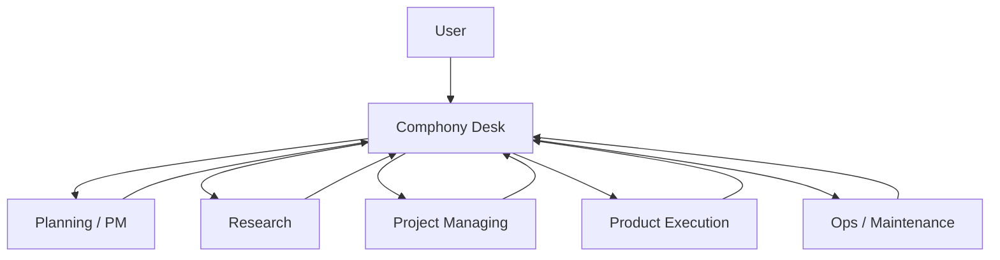

# Operating-Level Development Plan

This document defines how `Comphony` should evolve from a working prototype into an operating-level system that can be used repeatedly by real users with less manual glue, less script sprawl, and clearer role separation.

This is intentionally a capability plan, not a time estimate.

## 1. Objective

The target is not just "make Symphony work with Linear."

The target is to make `Comphony` function as a repeatable operating layer where:

- a user speaks to one intake lane
- work is routed automatically into the right downstream lane
- each lane has a clear role and contract
- repos, workflows, skills, and validation are generated consistently
- downstream work reports back into the parent request
- the whole system can be installed, validated, reset, and reused

## 2. Product Definition

`Comphony` should become a company operating kit with five durable layers:

1. `Company config`
   - source of truth for lanes, roles, repos, Linear projects, and report contracts
2. `Comphony CLI`
   - one command surface for setup, sync, validation, routing, and reporting
3. `Role skills`
   - Desk, PM, Research, Design, Dev, Project Admin, and Ops behavior packages
4. `Runtime workflows`
   - generated local workflow files derived from config
5. `Validation and smoke tests`
   - repeatable checks proving the system still works end-to-end

## 3. Current State

The current system is already useful, but it is still closer to a strong prototype than an operating product.

What already works:

- `Comphony Desk` exists as a single intake lane
- downstream routing to `Idea Lab`, `Project Managing`, and `Product - Core` exists
- parent issue -> child issue -> return report flow exists in parts
- local setup and validation scripts exist
- design-oriented skill support now exists through `ui-ux-pro-max`

What is still too static:

- routing logic is split across workflow prompts and shell helpers
- lane contracts are described in markdown instead of a structured config
- some return-report flows are lane-specific rather than system-wide
- `Project Managing` still contains smoke-test DNA
- `Ops / Maintenance` is conceptual but not fully implemented
- real behavior is partly in tracked docs and partly in ignored local runtime files

## 4. Core Design Principles

All future work should follow these principles.

### 4.1 One front door

Users should not need to choose between multiple projects unless they want to.

Default mode:

- user creates issue in `Comphony Desk`
- Desk classifies and delegates
- final reporting returns to Desk

### 4.2 Config over hardcoded scripts

Lane definitions, route rules, state mappings, and repo strategies should live in structured config, not be duplicated across multiple shell files.

### 4.3 Skills over prompt sprawl

Role behavior should be encapsulated in role-specific skills instead of being repeated in many large workflow prompts.

### 4.4 Generated runtime, tracked templates

Tracked files should define the platform.
Generated runtime files should be reproducible from config.

### 4.5 Every lane needs a return contract

Every child lane must know:

- who the parent is
- what output is expected
- what state transition is required
- how to report completion

### 4.6 Validation must be first-class

Setup is not complete until the system proves:

- Linear can be reached
- workflows can be generated
- a Desk request can be delegated
- a child lane can report back
- the parent can close correctly

## 5. Target Capability Model

The target operating model is:



Inside product execution, the system should support relay operation:


## 6. Workstreams

The development effort should be organized into the following workstreams.

## 6.1 Company Config Layer

Create one structured config file, for example:

- `company.yaml`
- or `company.toml`

This file should define:

- company name
- Linear team
- Desk project
- downstream lanes
- lane types
- active/terminal states
- repo source rules
- workspace rules
- default skills
- return-report contract
- runtime port allocation
- smoke-test templates

Minimum desired schema:

```yaml
company:
  name: Comphony
linear:
  team: TAH
desk:
  project: Comphony Desk
  states: [Inbox, Clarifying, Triaged, Waiting, Reported, Done]
lanes:
  - key: idea_lab_planning
    type: planning
    project: Idea Lab
    state: Planning
    repo_mode: none
    skill: compony-pm
  - key: product_core_dev
    type: dev
    project: Product - Core
    state: Todo
    repo_mode: canonical
    repo_slug: product-core
    skill: compony-dev
contracts:
  parent_child:
    report_state: Reported
    close_state: Done
```

Success condition:

- the system can be regenerated from config without hand-editing many scripts

## 6.2 Comphony CLI

Create a real `comphony` CLI so the system stops depending on scattered shell entry points.

Initial command set:

- `comphony init`
- `comphony validate`
- `comphony reset`
- `comphony sync-linear`
- `comphony generate-workflows`
- `comphony route`
- `comphony create-child`
- `comphony report-child`
- `comphony close-parent`
- `comphony smoke-test`
- `comphony inspect`

Expected outcomes:

- shell helpers become thin wrappers or disappear
- setup becomes discoverable
- automation becomes scriptable
- one interface can be used by both humans and agents

## 6.3 Lane Contracts

Replace freeform lane behavior with formal lane contracts.

Each lane must define:

- input shape
- output shape
- artifact expectations
- completion report format
- default next lane

Examples:

- `Planning`
  - output: scope, assumptions, acceptance criteria
- `Research`
  - output: options, evidence, recommendation
- `Design`
  - output: design-system draft, page states, handoff note
- `Dev`
  - output: code change, validation result, review note
- `Project Admin`
  - output: repo, Linear project, workflow, setup artifact
- `Ops`
  - output: fix summary, operational note, follow-up action

Success condition:

- a parent lane can interpret a child result without custom parsing for each route

## 6.4 Role Skills

Promote role behavior into reusable skills.

Recommended skills:

- `comphony-desk`
- `comphony-pm`
- `comphony-research`
- `comphony-design`
- `comphony-dev`
- `comphony-project-admin`
- `comphony-ops`

Each skill should contain:

- role instructions
- required outputs
- common edge cases
- preferred tools
- lane-specific QA expectations

Example:

- `comphony-design`
  - use `ui-ux-pro-max` first
  - create or refine a design system
  - produce handoff notes before implementation

Success condition:

- workflow prompts become shorter and more stable

## 6.5 Workflow Generation

Tracked sample workflows should remain templates.
Actual runnable workflows should be generated by CLI from config.

Generated outputs should include:

- Desk workflow
- PM workflow
- Research workflow
- Design workflow
- Dev workflow
- Project Admin workflow
- Ops workflow

Success condition:

- adding a new product lane does not require hand-copying multiple files

## 6.6 Routing Engine

Desk routing should move from prompt-only classification to config-backed routing with clear heuristics.

Routing should consider:

- request intent
- completeness of requirements
- target product/repo
- expected output type
- whether code work is ready

Recommended route groups:

- vague request -> Planning
- comparison/research -> Research
- system bootstrap -> Project Admin
- implementation-ready -> Product Dev
- maintenance/fix/cleanup -> Ops

Success condition:

- adding a new lane means updating config, not rewriting routing logic everywhere

## 6.7 Reporting and Parent Closure

Unify report-back behavior for all lanes.

There should be one structured report format, for example:

```yaml
report:
  parent_issue_id: ...
  child_issue_id: ...
  lane: design
  status: completed
  summary: ...
  artifacts:
    - path: ...
  next_lane: todo
```

The system should then:

1. post the report to the Desk parent
2. move the parent to `Reported`
3. let Desk summarize
4. close the parent to `Done` when complete

Success condition:

- all lanes use the same close loop

## 6.8 Project Admin as a Real Provisioning Layer

`Project Managing` should stop being smoke-test flavored and become a real provisioning lane.

It should be able to:

- create a canonical repo or register an existing repo
- create a Linear project
- create required states if missing
- generate workflow files
- emit a smoke-test issue
- report final paths and identifiers back to Desk

Success condition:

- a planning document can become an operating product lane with minimal manual work

## 6.9 Design and Publishing Operations

The design lane should support both design reasoning and implementation handoff.

Minimum expected capabilities:

- generate a design system draft using `ui-ux-pro-max`
- create page-specific overrides
- define copy tone and interaction rules
- hand off to dev or publishing lane

Optional publishing lane:

- implement frontend polish
- run visual QA
- capture screenshots
- produce review notes

Success condition:

- design work becomes a reusable lane, not a loose ad hoc step

## 6.10 Ops Lane

Add a real `Ops / Maintenance` lane.

Typical issue types:

- incident follow-up
- env/config cleanup
- workflow repair
- deployment support
- observability or automation fixes

Success condition:

- operational work no longer gets awkwardly forced into Product or Project Admin

## 6.11 Validation and Smoke Testing

The system needs layered validation.

Required validation classes:

- config validation
- env validation
- Linear reachability
- workflow generation validation
- Desk routing smoke test
- child report-back smoke test
- parent close-loop smoke test
- lane-specific smoke tests

Expected command:

```bash
comphony smoke-test
```

Success condition:

- the platform can prove it is healthy before users rely on it

## 6.12 Reset and Reproducibility

Every setup must be reproducible.

The system should support:

- reset local generated state
- rebuild runtime workflows
- re-run validation
- re-run smoke tests

Success condition:

- a new machine can be brought to a working state without tribal knowledge

## 7. Recommended Build Order

No duration is assigned here, but the dependency order should be:

1. `company config`
2. `comphony CLI skeleton`
3. `shared report contract`
4. `workflow generation`
5. `Desk routing engine`
6. `Project Admin real provisioning`
7. `Design lane strengthening`
8. `Ops lane`
9. `full smoke-test coverage`
10. `role skill extraction`

This order matters because later layers become much easier once the config, CLI, and report contract exist.

## 8. Definition of Operable

The platform should be considered operable only when all of the following are true.

- A new user can clone the repo and ask Codex to set it up.
- `MISSION.md`, `.env`, workflows, and runtime artifacts can be generated consistently.
- `Comphony Desk` is the default human intake lane.
- Desk can route to Planning, Research, Project Admin, Product Dev, Design, and Ops.
- Every child lane can report back in a structured way.
- Desk can summarize and close the parent issue without manual glue.
- New product lanes can be added from config and regenerated.
- Validation and smoke tests can be rerun after reset.
- The docs reflect the actual runtime behavior.

## 9. Definition of Flexible

The platform should be considered flexible only when all of the following are true.

- Adding a new lane does not require copying multiple scripts by hand.
- Changing a route does not require editing both prompts and multiple helpers.
- A product can use only the lanes it needs.
- A research-only project can run without repo bootstrap.
- A design-heavy product can add Design and Publishing lanes without changing Desk fundamentals.
- A code-heavy product can add multiple Dev lanes or repo-specific workflows.

## 10. What Not To Do

Avoid these traps:

- do not keep growing shell helpers without introducing config and CLI
- do not encode contracts only in prose comments
- do not mix smoke-test behavior with real provisioning behavior
- do not let docs and runtime drift apart
- do not force all non-dev work into one generic lane
- do not make users choose internal routing details unless necessary

## 11. Immediate Next Design Tasks

The next design tasks should be:

1. define the `company.yaml` schema
2. define the `comphony` CLI command map
3. define the shared child report contract
4. split `Project Managing` into real provisioning behavior
5. add `Ops` and `Design` return-report flow
6. convert route helpers into CLI-backed actions
7. update docs so templates and runtime follow the same model

## 12. Final Position

`Comphony` already proves the concept.

The next stage is to stop treating it like a collection of clever scripts and start treating it like an operating platform:

- config-driven
- skill-based
- CLI-controlled
- lane-contract oriented
- validated by smoke tests

That is the level where users can reliably ask for outcomes instead of manually shepherding the machinery.
