# Symphony Basics

이 문서는 Symphony를 처음 접할 때 가장 먼저 알아야 할 내용을 한 번에 설명한다.

다루는 내용은 아래 다섯 가지다.

1. Symphony가 무엇인지
2. Symphony와 Linear를 어떻게 연결하는지
3. Workflow 파일이 무엇인지
4. 이슈 티켓이 어떻게 처리되는지
5. 전체 작동 흐름이 어떻게 이어지는지

## 1. Symphony는 무엇인가

Symphony는 `Linear 이슈를 읽고`, `이슈별 작업 공간을 만들고`, `그 안에서 Codex를 실행해 작업을 수행하는 오케스트레이터`다.

한 줄로 정리하면:

- Linear는 작업 지시서
- Workflow는 실행 정책
- Workspace는 실제 작업 공간
- Symphony는 이 셋을 연결해서 일을 굴리는 러너

즉 Symphony 자체가 코드를 직접 들고 있는 것은 아니고, "어떤 이슈를 어떤 방식으로 처리할지"를 계속 감시하고 실행하는 프로세스라고 보면 된다.

## 2. Symphony와 Linear는 왜 같이 쓰는가

둘의 역할은 분명히 다르다.

### Linear

- 무슨 일을 할지 적는다
- 상태를 관리한다
- 작업 결과와 handoff를 남긴다

### Symphony

- 어떤 Linear 프로젝트를 볼지 정한다
- 어떤 이슈를 잡을지 정한다
- 이슈별 workspace를 만든다
- Codex를 실행해 코드 수정, 리서치, 문서화 같은 작업을 수행한다

즉 Linear는 "업무 관리 시스템"이고, Symphony는 "그 업무를 실제로 집어 실행하는 자동화 레이어"다.

## 3. Symphony와 Linear는 어떻게 연동하는가

연동은 앱 로그인으로 되는 것이 아니라 `API 키 + workflow 설정`으로 된다.

최소 연결 순서는 아래와 같다.

1. Linear에서 `Personal API Key`를 만든다.
2. Symphony가 볼 Linear 프로젝트를 만든다.
3. workflow 파일에 `project_slug`를 적는다.
4. workflow 파일에 workspace 경로와 repo 준비 방식을 적는다.
5. `LINEAR_API_KEY` 환경 변수를 설정한다.
6. Symphony를 workflow 파일과 함께 실행한다.

### 추천 로컬 레이아웃

경로를 따로 정하지 않았다면 아래 구조를 기본값으로 쓰는 것이 좋다.

- repo root: `/Users/you/Documents/comphony/repos`
- workspace root: `/Users/you/Documents/comphony/workspaces`
- workflow root: `/Users/you/Documents/comphony/workflows`
- `docs/workflows/`는 샘플 템플릿, `workflows/`는 실제 실행용 파일

예시:

```yaml
---
tracker:
  kind: linear
  api_key: $LINEAR_API_KEY
  project_slug: "product-foo"
  active_states:
    - Todo
    - In Progress
    - Rework

workspace:
  root: /Users/you/Documents/comphony/workspaces/product-foo

hooks:
  after_create: |
    git clone --depth 1 --branch main file:///Users/you/Documents/comphony/repos/product-foo .
    pnpm install --frozen-lockfile

codex:
  command: codex app-server
---

You are working on Linear issue {{ issue.identifier }}.
```

실행 예시:

```bash
cd /path/to/symphony/elixir
mise exec -- ./bin/symphony \
  --i-understand-that-this-will-be-running-without-the-usual-guardrails \
  --port 4000 \
  /Users/you/Documents/comphony/workflows/WORKFLOW.product-foo.md
```

이 설정의 의미는 간단하다.

- `project_slug`로 어느 Linear 프로젝트를 볼지 정한다.
- `active_states`로 어떤 상태의 이슈를 집을지 정한다.
- `workspace.root`로 이슈별 작업 폴더를 어디에 만들지 정한다.
- `after_create`로 새 workspace 안에 무엇을 준비할지 정한다.

## 4. Workflow 파일은 무엇인가

Workflow 파일은 Symphony의 운영 규칙을 담은 문서다.

이 파일이 정하는 것은 보통 아래다.

- 어떤 Linear 프로젝트를 감시할지
- 어떤 상태를 작업 대상으로 볼지
- workspace를 어디에 만들지
- repo를 clone할지, worktree를 붙일지, 빈 폴더만 만들지
- Codex를 어떤 역할로 동작시킬지

즉 이슈는 "무엇을 할지"를 말하고, workflow는 "어디서 어떻게 할지"를 말한다.

중요한 포인트는 이것이다.

- repo 경로는 이슈가 아니라 workflow가 안다
- 역할 성격(PM / Research / Design / Dev)도 workflow가 정한다
- 같은 Linear 안에서도 workflow를 여러 개 둘 수 있다

## 5. 이슈 티켓은 어떻게 써야 하나

이슈는 보통 폴더 경로나 clone 방법을 적는 곳이 아니다.

이슈에는 이런 정보가 들어가면 된다.

- 목표
- 범위
- 기대 결과
- 검증 방법

예:

```md
Title: Add settings summary card

Goal:
Add a compact settings summary card to the dashboard.

Scope:
- show current environment
- show API base URL
- keep the UI minimal

Validation:
- dashboard renders without errors
- relevant tests pass
```

이렇게 쓰면 Symphony는 이 내용을 작업 지시로 이해하고, workflow가 준비한 workspace 안에서 실제 작업을 수행한다.

## 6. 이슈는 실제로 어떻게 처리되는가

전체 흐름은 아래와 같다.

```mermaid
flowchart LR
    A["Linear issue created"] --> B["Symphony polls configured project"]
    B --> C["Workflow matches project and state"]
    C --> D["Workspace created for issue"]
    D --> E["after_create prepares repo or notes folder"]
    E --> F["Codex runs with workflow prompt + issue content"]
    F --> G["Code, notes, or report updated in workspace"]
    G --> H["Linear state and comments updated"]
```



단계별로 보면:

1. 사용자가 Linear 프로젝트에 이슈를 만든다.
2. 이슈 상태를 workflow가 보는 상태로 둔다.
3. Symphony가 해당 프로젝트와 상태를 감시하다 이슈를 발견한다.
4. 이슈 ID 기준 workspace를 만든다.
5. `after_create`가 실행되어 repo clone, install, notes 폴더 생성 같은 준비 작업을 한다.
6. Codex가 workflow prompt와 이슈 본문을 받아 실제 작업을 한다.
7. 결과를 workspace 파일과 Linear 코멘트/상태에 반영한다.

## 7. 실제 코드는 어디에서 수정되는가

이 부분이 가장 많이 헷갈린다.

Symphony는 보통 원본 repo를 직접 수정하지 않는다. 대신 `이슈별 workspace` 안에서 작업한다.

예를 들면:

- 원본 repo: `/Users/you/Documents/comphony/repos/product-foo`
- workspace root: `/Users/you/Documents/comphony/workspaces/product-foo`
- 특정 이슈 workspace: `/Users/you/Documents/comphony/workspaces/product-foo/FOO-12`

즉 실제 코드 수정은 `FOO-12` 같은 이슈별 작업 폴더 안에서 일어난다.

## 8. 코드 작업과 리서치 작업은 무엇이 다른가

기본 구조는 같지만 `after_create`가 다르다.

### 코드 작업

```yaml
hooks:
  after_create: |
    git clone --depth 1 --branch main file:///Users/you/Documents/comphony/repos/product-foo .
    pnpm install --frozen-lockfile
```

### 리서치 작업

```yaml
hooks:
  after_create: |
    mkdir -p notes output sources
```

즉 리서치 이슈는 repo clone 없이도 처리할 수 있다. workspace는 이 경우 "조사용 폴더"가 된다.

## 9. 역할별로 나눠서 운영할 수 있는가

가능하다. 다만 보통은 "같은 이슈를 여러 에이전트가 동시에 본다"기보다 `상태 기반 릴레이`로 운영한다.

예:

- PM workflow -> `Planning`
- Research workflow -> `Research`
- Design workflow -> `Design`
- Dev workflow -> `Todo`, `In Progress`, `Rework`

그러면 하나의 Linear 프로젝트 안에서도 역할별로 충돌 없이 이어서 처리할 수 있다.

## 10. 가장 추천하는 시작 방식

처음에는 복잡하게 나누지 않는 편이 좋다.

가장 추천하는 시작 구조:

1. Linear 프로젝트 1개
2. dev workflow 1개
3. 제품 repo 1개
4. `repos/`, `workspaces/`, `workflows/` 구조 1개

그 다음 필요할 때:

- `Research workflow` 추가
- `Design workflow` 추가
- `Project Managing` 같은 메타 프로젝트 추가

## 11. 같이 읽으면 좋은 문서

- [Local Layout](LOCAL_LAYOUT.md)
- [Comphony Company Model](COMPHONY_COMPANY_MODEL.md)
- [Issue Lifecycle](ISSUE_LIFECYCLE.md)
- [Workflow Parts](WORKFLOW_PARTS.md)
- [Linear + Symphony Guide](LINEAR_SYMPHONY_WORKFLOW_GUIDE.md)
- [Scenario Matrix](SCENARIO_MATRIX.md)
